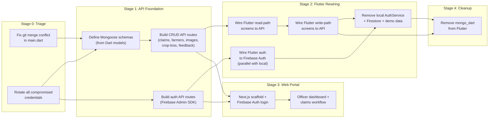

# MIGRATION_STRATEGY.md — Krishi Bandhu Migration Plan

> **Governing documents:** [ARCHITECTURE_SPEC.md](./ARCHITECTURE_SPEC.md) (system design) · [TECH_DECISIONS.md](./TECH_DECISIONS.md) (technology choices)  
> **Scope:** Strategy only. No code. No implementation details.  
> **Audience:** You — a solo developer migrating a system while keeping it running.

---

## 1. Migration Philosophy

### The Strangler Fig

The migration follows the [Strangler Fig pattern](https://martinfowler.com/bliki/StranglerFigApplication.html). You do not tear out the old system and replace it. You grow the new system around it. You redirect one data path at a time — from direct MongoDB access to the new API, from local auth to Firebase Auth, from Firestore to MongoDB. When every path has been redirected, the old code is dead. You delete it.

At no point during the migration does the app stop working. At no point are you "between systems" with nothing deployable.

### Three governing principles

**Principle 1: Always deployable.**
After every unit of work, the Flutter app must build and run. If you break the app for three days while rewiring authentication, you've lost your safety net. Migrate one seam at a time. Test after each seam. Commit after each seam.

**Principle 2: New code in your language, old code in theirs.**
You write the backend API and web portal in TypeScript/JavaScript — your strongest language. You modify the Flutter app only at the integration points (API calls, auth wiring, removing hardcoded data). You do not rewrite Flutter internals. You do not refactor Dart code for style. You touch the minimum Dart surface area required to connect the app to your new backend.

**Principle 3: Build the replacement before removing the original.**
Never delete old code until the replacement is tested and deployed. The local `AuthService` stays in the codebase until Firebase Auth is verified working end-to-end. Firestore calls stay until the equivalent API endpoints are live and the Flutter screens are rewired. Only then do you delete.

---

## 2. What Should Be Reused

These components are preserved intact. You do not modify their internal logic. You may change how they are called (e.g., a screen that currently calls Firestore directly will be rewired to call your API through a Provider), but the component itself is unchanged.

| Component | Why reuse |
|-----------|----------|
| **AR Camera services** (`ValidationEngine`, `ImageQualityAnalyzer`, `CaptureTaskManager`, `AROverlayPainter`) | Best architecture in the codebase. Complex domain logic that works. You do not understand it deeply enough to safely modify it, and you don't need to. |
| **Offline sync pipeline** (`LocalStorageService` → `AutoSyncService` → `WorkManager` → Cloudinary upload) | Correct offline-first design. The upload destination (Cloudinary) doesn't change. The sync trigger (WorkManager) doesn't change. |
| **Perceptual hash deduplication** (`ImageDeduplicationService`) | Pure algorithm. No external dependencies. Works correctly. |
| **Aadhaar Verhoeff validation** (`AadharService`) | Mathematically correct. Standalone. No reason to touch. |
| **GoRouter route table** (structure) | The route definitions are correct. You'll add the `redirect` callback for auth, but the route paths and screen bindings stay. |
| **Material 3 theming** (`app_themes.dart`, `pmfby_theme.dart`) | Working theme system. No migration needed. |
| **Premium calculator logic** | Pure business logic (PMFBY rates, subsidy calculation). Reuse in Flutter as-is. Port the calculation logic to TypeScript for the web portal — a direct translation, not a rewrite. |
| **`IndiaData` static dataset** | State/district/crop reference data. Static. No migration needed. |
| **Audio guidance system** (`AudioService` + assets) | Works. Not affected by any migration. |
| **Splash screen + animations** | Working UI. Not affected by migration. |
| **MongoDB schemas and indices** | The database structure (`farmers`, `officials`, `crop_images`, `claims`, `crop_loss_intimations`, `feedback_reports`) is your API's target schema. The Dart model definitions (`FarmerModel`, `CropImageModel`, `ClaimModel`, `CropLossModel`) become the source of truth for your Mongoose schemas. |

---

## 3. What Should Be Rewritten

These components are replaced with new implementations. The old code is not modified — new code is written, tested, and then the old code is deleted.

| Component | Current state | Replacement | Why rewrite, not refactor |
|-----------|--------------|-------------|--------------------------|
| **Data access layer** | 4 Dart repositories calling MongoDB directly via `mongo_dart` + 3 screens calling `FirestoreService()` in `initState()` | Next.js API routes (Mongoose + MongoDB) consumed by both Flutter (via HTTP) and web portal (via direct import) | The entire point of the migration. The mobile app must stop talking to the database. The API becomes the sole data gateway. |
| **Authentication** | Dual system: `AuthService` (SharedPreferences + plaintext passwords) alongside `FirebaseAuthService` (Firebase Auth) | Firebase Auth as the single identity provider, verified server-side in the API via Firebase Admin SDK | The dual system is the root cause of the identity crisis, the "Anshika" fallback, and the missing route guard. It cannot be fixed — only replaced. |
| **Officer dashboard data** | Hardcoded demo statistics (`1,247 claims`, `5,680 farmers`, `₹12.54 Cr`) returned from inline `Map<String, dynamic>` literals | Real aggregation queries in the API, consumed by both the Flutter officer dashboard and the web portal dashboard | Demo data is not a data layer. It's a placeholder that became permanent. The API provides real data; both clients consume it. |
| **Claims management** | Hardcoded `List<InsuranceClaim>` built inside the claims screen | API endpoints: `GET /api/claims`, `POST /api/claims`, `PUT /api/claims/:id/review` | Same as above. The claims screen currently has no backend. |
| **OTP verification** | Client-side validation via `static Map<String, OTPData>` in `EmailOTPService` | Firebase Auth `signInWithPhoneNumber()` — server-validated OTP | Client-side OTP validation is a security non-starter. Firebase Auth handles this end-to-end. |

---

## 4. What Should Be Archived

These components are deleted from the active codebase. "Archived" means they remain accessible in git history but are removed from `lib/`.

| Component | When to archive | Why |
|-----------|----------------|-----|
| **`auth_service.dart`** (local `AuthService`) | After Firebase Auth is the sole working auth path and has been tested | Replaced by Firebase Auth. Keeping it creates the risk of someone (including future you) accidentally using the old path. |
| **`email_otp_service.dart`** | After Firebase Phone Auth is working | Replaced by Firebase Auth phone OTP. SMTP credentials were a security liability. |
| **`firestore_service.dart`** | After all 3 screens that use it (`DashboardScreen`, `FileClaim`, `FeedbackReportScreen`) are rewired to the API | Firestore is dropped as a database (ARCHITECTURE_SPEC TD-4). The service has no purpose once the API serves the same data from MongoDB. |
| **`enhanced_satellite_screen_backup.dart`** (61 KB) | Immediately | A backup file committed to source control. Git history serves this purpose. |
| **Demo user creation** in `main.dart` (`demo_farmer_001`, `demo_officer_001`) | After Firebase Auth is the sole auth path | Production code should not create fake users. Development seeding belongs in a separate script or API endpoint, not the app binary. |
| **Hardcoded "Anshika" fallback profile** in `DashboardScreen` | After Firebase Auth is the sole auth path (the null-user condition that triggers this fallback will no longer exist) | A bug, not a feature. |
| **`bcrypt` dependency** in `pubspec.yaml` | After Firebase Auth migration | Declared, never used. Dead dependency. |

---

## 5. What Should Be Migrated Later

These are real improvements that are explicitly deferred. Each has a defined trigger — a condition under which it becomes worth doing.

| Item | Why defer | Trigger to start |
|------|----------|-----------------|
| **Localization file split** (`app_localizations.dart` → per-feature files) | A 3,632-line mechanical refactor that doesn't change functionality. Doing it during the migration adds risk (merge conflicts, broken string references) with no user-facing benefit. | After the API migration is complete and the codebase is stable. |
| **God screen decomposition** (officer dashboard, farmer dashboard, weather, satellite) | Each screen is 1,000–2,000 lines. Decomposing them is valuable but risky without tests. The migration already changes how these screens fetch data — decomposing them simultaneously creates compound risk. | After the API migration is complete AND after basic tests exist for the screen's data flow. |
| **Web portal: satellite maps, weather, district efficiency, exports** | The MVP web portal (TECH_DECISIONS §8) covers the claims workflow. These features are valuable but not essential for the portfolio or for officer productivity. | After the MVP web portal is deployed and validated with real usage. |
| **iOS support** | One config change, but the app has P0 security defects. Shipping to a second app store with known vulnerabilities is irresponsible. | After all P0 issues are resolved and the app has been tested on the API-backed architecture. |

---

## 6. Major Risks

| # | Risk | Probability | Impact | Category |
|---|------|-------------|--------|----------|
| R1 | **Breaking the Flutter app during auth migration** — Removing local auth before Firebase Auth is fully wired causes the app to become inaccessible | High | Critical | Migration |
| R2 | **Data inconsistency during partial migration** — Some screens use the API, others still use direct MongoDB/Firestore. A record created via the API may not be visible to a screen still reading from Firestore. | High | High | Data |
| R3 | **MongoDB schema drift** — The Mongoose schemas in your API diverge from the Dart model definitions. Fields are renamed, types change, nested objects restructured. Data written by the API can't be read by Flutter screens that haven't been migrated yet. | Medium | Critical | Data |
| R4 | **Learning curve stall** — You hit a Flutter/Dart concept you don't understand (Isolates, platform channels, build context lifecycle) and spend days debugging instead of building | Medium | Medium | Productivity |
| R5 | **Scope creep into Flutter refactoring** — You see a 1,963-line God widget and feel compelled to decompose it. Three days later, you have a half-refactored screen that doesn't compile. | Medium | High | Scope |
| R6 | **Credential exposure during migration** — You commit new API keys, Firebase service account JSON, or MongoDB connection strings to git during development | Medium | Critical | Security |
| R7 | **Firebase Auth migration loses existing test users** — Local auth users stored in SharedPreferences don't exist in Firebase Auth. After switching, no one can log in. | High | Medium | Migration |
| R8 | **Deployment configuration mismatch** — The Flutter app points to a local API URL in development. You deploy the web portal but forget to update the Flutter app's API base URL. The mobile app calls localhost in production. | Medium | High | Operations |

---

## 7. Risk Mitigation

| Risk | Mitigation |
|------|-----------|
| **R1: Auth breakage** | Run both auth systems in parallel during migration. The GoRouter redirect checks Firebase Auth first, falls back to local auth if Firebase user is null. Only remove the fallback after Firebase Auth login is tested end-to-end on a real device. The parallel window should last 1–2 weeks maximum. |
| **R2: Data inconsistency** | Migrate screens in dependency order, not in random order. Start with screens that only READ data (officer dashboard, claims list). These can switch to the API while write-path screens (file claim, crop loss, feedback) continue using the old path. Once reads are verified, migrate writes. |
| **R3: Schema drift** | Define Mongoose schemas by reading the Dart model files directly. Use the `toMap()` / `fromMap()` methods as the schema specification — they define exactly what fields exist and what types they are. Do not "improve" the schema during migration. Match the existing shape exactly. Schema improvements happen after migration is complete. |
| **R4: Learning curve stall** | Set a 2-hour time-box for any single Flutter problem. If you can't solve it in 2 hours, skip it, work on the API or web portal (your strength), and return to the Flutter problem the next day with fresh eyes. Ask for help (Stack Overflow, Flutter Discord) before day 2. |
| **R5: Scope creep** | Do not open any Flutter file that is not on your current task list. If you see a God widget, close the file. You are not refactoring Flutter internals during the migration. Write the observation in a `TECH_DEBT.md` file and move on. |
| **R6: Credential exposure** | Create `.env.local` on day 1 with all secrets. Add `.env.local` and `*.env` to `.gitignore` on day 1. Use `process.env.MONGODB_URI` in your API routes. Verify with `git diff --cached` before every commit. Install a pre-commit hook (e.g., `git-secrets` or `husky` + grep) that rejects commits containing patterns like `mongodb+srv://` or API key formats. |
| **R7: Lost test users** | Before switching auth, create the same test accounts in Firebase Auth (via Firebase Console or a one-time script). Use the same email/phone and a known password. After switching, verify login with these accounts. Local SharedPreferences users are not "migrated" — they are re-created in Firebase Auth. There is no user data to migrate because the system has no real users yet (it's a portfolio project with demo data). |
| **R8: Deployment mismatch** | Use environment-specific API base URLs from day 1. In Flutter: `--dart-define=API_BASE_URL=https://your-app.vercel.app/api` for production, `http://localhost:3000/api` for development. In Next.js: `NEXT_PUBLIC_API_URL` environment variable. Never hardcode a URL. |

---

## 8. Dependency Graph

Every work item depends on one or more predecessors. Nothing in the right side of the graph can start until its dependencies on the left are complete.



### Critical path

The longest dependency chain determines your minimum timeline:

```
Fix git conflict → Define schemas → Build CRUD routes → Wire read screens → Wire write screens → Remove old code → Remove mongo_dart
```

This is 7 sequential stages. The web portal (`J → K`) runs in parallel with Flutter rewiring (`F → G → H → I`) because both depend on the API routes (`D`, `E`) but not on each other.

### Parallelizable work

| While you're doing... | You can simultaneously... |
|----------------------|--------------------------|
| Building API auth routes (D) | Defining Mongoose schemas (C) |
| Building CRUD API routes (E) | Nothing — this is the critical path bottleneck |
| Wiring Flutter read screens (G) | Building Next.js scaffold + login (J) |
| Wiring Flutter write screens (H) | Building officer dashboard (K) |

---

## 9. Recommended Migration Order

### Stage 0: Triage (Day 1–2)

**Entry criteria:** Access to the repository.  
**Exit criteria:** The app compiles. No secrets in source. No merge conflicts.

**What happens:**
- Resolve the git merge conflict in `main.dart` (include the `DistrictEfficiencyScreen` route)
- Rotate every compromised credential: MongoDB password, Cloudinary secret, OpenWeatherMap key, SMTP credentials
- Set up environment variable injection (`--dart-define` for Flutter, `.env.local` for Next.js)
- Add `.env*` to `.gitignore`
- Verify the app still builds and runs

**Why first:** You cannot do any subsequent work on a codebase that may not compile and has actively compromised credentials. This is triage, not engineering.

---

### Stage 1: Build the API (Weeks 1–4)

**Entry criteria:** Stage 0 complete. App compiles. Credentials rotated.  
**Exit criteria:** All API routes return correct data when tested with a REST client (Postman/Insomnia/httpie). Firebase Admin SDK verifies tokens correctly.

**What happens:**
- Initialize the Next.js project (this becomes your web portal AND your API)
- Define Mongoose schemas by reading the Dart model files (`FarmerModel.toMap()`, `ClaimModel.toMap()`, etc.) — match the existing MongoDB document shape exactly
- Build auth routes: login (verify Firebase ID token → set session cookie), session verification, role check
- Build CRUD routes for each resource domain: claims, farmers, crop-images, crop-loss, feedback
- Build aggregation routes: dashboard stats, crop loss statistics, feedback statistics

**Why this order:** The API is the keystone. Every subsequent stage depends on it. Nothing else can start until the API serves real data.

**Strategic note:** You are building the API against the existing MongoDB data. The existing Flutter app is still writing to MongoDB directly via `mongo_dart`. This means your API is reading the same data that the Flutter app writes. This is intentional — it lets you test the API against real data shapes without changing the Flutter app yet.

---

### Stage 2: Rewire the Flutter App (Weeks 4–8)

**Entry criteria:** Stage 1 complete. API routes tested and deployed.  
**Exit criteria:** The Flutter app performs all data operations through the API. No direct MongoDB or Firestore calls remain. Firebase Auth is the sole identity provider.

**What happens, in this order:**

**2a. Auth (Week 4–5)**
- Activate Firebase Auth as the login path in the Flutter app
- Run both auth systems in parallel: Firebase Auth first, local auth as fallback
- Implement the GoRouter `redirect` callback using `FirebaseAuth.instance.currentUser`
- Test login, registration, and session persistence on a real device
- Once verified: remove local `AuthService`, `EmailOTPService`, demo user creation

**2b. Read paths (Week 5–6)**
- Create a Dart HTTP API client class that calls your Next.js API routes
- Rewire read-only screens to use the API client instead of direct MongoDB/Firestore:
  - Officer dashboard (replace hardcoded demo stats with API call)
  - Claims list (replace hardcoded demo claims with API call)
  - Farmer profile (replace Firestore `getUserProfile` with API call)
  - Feedback list (replace direct MongoDB feedback query with API call)
- Each screen is rewired and tested individually. Do not batch.

**2c. Write paths (Week 7–8)**
- Rewire write operations to use the API:
  - File claim (replace Firestore `submitClaim` with API call)
  - Crop loss intimation (replace direct MongoDB insert with API call)
  - Feedback submission (replace direct MongoDB insert with API call)
  - Image metadata save (replace direct MongoDB insert with API call — image binary still goes to Cloudinary directly, metadata goes through the API)
- Each write path is tested individually.

**Why read before write:** Read operations are lower risk. If the API returns slightly different data shapes, the worst case is a UI display bug — the app doesn't crash, and no data is corrupted. Write operations are higher risk — a malformed write can create bad records in the database. Proving reads work first gives you confidence in the API before trusting it with writes.

**Why auth before data:** If auth is broken, you can't test any authenticated API endpoint. Auth is the gate.

---

### Stage 3: Build the Web Portal MVP (Weeks 6–12)

**Entry criteria:** API auth routes deployed (from Stage 1). CRUD routes deployed (from Stage 1). Firebase Auth configured.  
**Exit criteria:** An officer can log in, view a dashboard with real stats, browse claims in a sortable/filterable table, open a claim detail, and submit an approve/reject decision.

**What happens:**
- Next.js scaffold with Firebase Auth login + session cookie
- `middleware.ts` for auth-protected routes
- Officer dashboard: stat cards with real numbers from the API aggregation endpoint
- Claims table: sortable, filterable, paginated data table (TanStack Table) reading from `GET /api/claims`
- Claim detail page: claim summary, attached images, officer review form posting to `PUT /api/claims/:id/review`
- Farmer directory: searchable, paginated table
- Feedback management: table with status updates

**Why parallel with Stage 2:** The web portal depends on the API (Stage 1), not on the Flutter rewiring (Stage 2). You can build the web portal while simultaneously rewiring Flutter screens. In practice, you'll alternate between them — web portal work when you need a break from Dart, Flutter work when you need a break from CSS.

---

### Stage 4: Cleanup (Week 12–13)

**Entry criteria:** Stage 2 complete. No direct MongoDB/Firestore calls in Flutter. Firebase Auth is sole identity.  
**Exit criteria:** `mongo_dart` removed from `pubspec.yaml`. `cloud_firestore` removed (or import-dead). No dead code related to local auth, Firestore, or demo data.

**What happens:**
- Remove `mongo_dart` from `pubspec.yaml` — this is the symbolic completion of the migration. The mobile app no longer has the capability to connect to the database directly.
- Remove `firestore_service.dart`
- Remove `mongodb_service.dart` and `mongodb_config.dart` from Flutter (the API now owns the MongoDB connection)
- Remove `bcrypt` from `pubspec.yaml`
- Remove `enhanced_satellite_screen_backup.dart`
- Run `flutter analyze` and resolve any unused import warnings
- Verify the app builds and runs cleanly

**Why last:** Deletion is the final act. You only delete code after you've proven the replacement works. Deleting early creates situations where you need to "undo the delete" to debug something — which is disorienting and error-prone.

---

### Stage 5: Polish and Ship (Weeks 13–16)

**Entry criteria:** Stages 0–4 complete. App builds. Web portal deployed. All data flows through the API.  
**Exit criteria:** Portfolio-ready. Demo-ready.

**What happens:**
- Write 15–25 tests for the API routes and key React components
- Deploy the web portal (Vercel)
- Write a `README.md` that tells the portfolio story (see TECH_DECISIONS.md final section)
- Record a 2-minute demo video showing the end-to-end flow: farmer captures image on mobile → officer reviews on web portal → claim approved
- Fix any UI polish issues that surfaced during testing
- Add basic error handling for API failures in both Flutter and web (loading states, error messages, retry buttons)

---

## The one-sentence summary

**Build the API first, rewire one screen at a time, never break the working app, and delete old code only after the replacement is proven.**

---

*This is a strategy document. It defines the order and the reasoning. Implementation details, code, and specific technical steps are deferred to the execution phase.*
