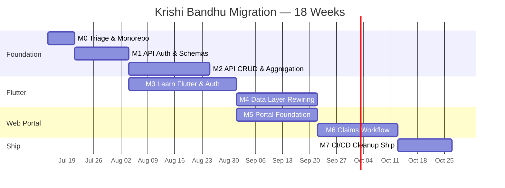

# PROJECT_ROADMAP.md — Krishi Bandhu Migration Roadmap

> **This is the last planning document.**  
> After approval, open your editor and start M0.  
>  
> **Governing documents:** [ARCHITECTURE_SPEC.md](./ARCHITECTURE_SPEC.md) · [TECH_DECISIONS.md](./TECH_DECISIONS.md) · [MIGRATION_STRATEGY.md](./MIGRATION_STRATEGY.md)  
> **Constraint:** 10–15 hours/week. Solo developer. MERN background. Learning Flutter.

---

## Time Budget

| Parameter | Value |
|-----------|-------|
| Available hours per week | 10–15 (assume 12 average) |
| Calendar weeks | 18 |
| Total hours | ~216 |
| Planned hours (all milestones) | ~214 |
| Buffer | ~0 — see "What to cut" at the bottom |

This is a tight plan. It is achievable if you maintain discipline on scope. The buffer is thin because the scope has already been cut aggressively in TECH_DECISIONS.md. If you fall behind, the "What to cut" section tells you what to drop.

---

## Milestone Overview



> **Overlap:** M3 starts during M2. M5 starts during M4. These are intentional — you interleave Flutter and web work to avoid fatigue from a single stack. You are one person, so "parallel" means "alternate between," not "do simultaneously."

---

## M0 — Triage & Monorepo Setup

**Week 1 · ~10 hours**

### Objective
Make the codebase safe to work on. Set up the monorepo structure that all future milestones build into.

### Deliverables
- [ ] Git merge conflict in `main.dart` resolved (include the `DistrictEfficiencyScreen` route)
- [ ] All compromised credentials rotated:
  - MongoDB Atlas password changed, old connection string invalidated
  - New Cloudinary API key/secret generated, old ones revoked
  - New OpenWeatherMap API key generated
- [ ] `.env.local` file created with all secrets, `.env*` added to `.gitignore`
- [ ] Flutter app updated to read credentials from `--dart-define` environment variables (no hardcoded fallbacks)
- [ ] Monorepo structure initialized:
  ```
  pmfby/
    apps/
      mobile/        ← existing Flutter app (moved)
      web/           ← empty Next.js project (scaffolded)
    packages/
      server/        ← empty Express project (scaffolded)
      shared-types/  ← empty TypeScript package (scaffolded)
  ```
- [ ] Verified: `flutter run` works from `apps/mobile/`
- [ ] Verified: `npm run dev` works from `apps/web/` (shows default Next.js page)
- [ ] Verified: `npm run dev` works from `packages/server/` (returns `{ status: "ok" }` on GET `/health`)

### Dependencies
None — this is the entry point.

### Estimated Effort
| Task | Hours |
|------|-------|
| Resolve merge conflict, test build | 1 |
| Rotate credentials, update `--dart-define` | 3 |
| Set up monorepo folder structure | 2 |
| Scaffold Next.js and Express projects | 2 |
| Verify all three projects run | 2 |
| **Total** | **10** |

### Success Criteria
- `flutter run` launches the app with no merge conflict errors
- No secret appears in any tracked file (verified with `git grep -i password`, `git grep mongodb+srv`)
- All three projects (`mobile`, `web`, `server`) start without errors

### Risks
| Risk | Mitigation |
|------|-----------|
| Credential rotation breaks the live Flutter app's MongoDB connection | The app already has timeout + catch-continue on MongoDB init. It will degrade gracefully. Fix the new credentials before sharing the build with anyone. |
| Monorepo tooling (npm workspaces, turborepo) adds unexpected complexity | Keep it simple: plain npm workspaces. No turborepo, no lerna, no nx. Just `"workspaces": ["apps/*", "packages/*"]` in the root `package.json`. |

### Exit Criteria
- [ ] All three projects run locally
- [ ] Zero secrets in git-tracked files
- [ ] Commit pushed to a clean branch

---

## M1 — Express API: Auth & Schemas

**Weeks 2–3 · ~22 hours**

### Objective
Build the authentication layer and data models that every subsequent API route depends on.

### Deliverables
- [ ] Mongoose schemas defined for all 6 collections:
  - `Farmer`, `Official`, `CropImage`, `Claim`, `CropLoss`, `FeedbackReport`
  - Each schema matches the existing MongoDB document shape exactly (read from Dart `toMap()` methods)
- [ ] TypeScript interfaces in `shared-types` package mirroring each Mongoose schema
- [ ] Firebase Admin SDK initialized in Express
- [ ] Auth middleware: extracts Firebase ID token from `Authorization: Bearer <token>` header, verifies via Admin SDK, attaches `uid` and `role` to request
- [ ] Auth routes:
  - `POST /api/auth/session` — verify ID token, return user profile from MongoDB
  - `GET /api/auth/me` — return current user from verified token
- [ ] Basic error handling middleware (400/401/404/500 with consistent JSON shape)
- [ ] 5–8 tests for auth middleware (valid token, expired token, missing token, invalid role)

### Dependencies
- M0 complete (monorepo structure exists, credentials rotated)

### Estimated Effort
| Task | Hours |
|------|-------|
| Study Dart model files, write Mongoose schemas | 6 |
| Write TypeScript interfaces in `shared-types` | 3 |
| Firebase Admin SDK setup + auth middleware | 5 |
| Auth routes | 3 |
| Error handling middleware | 2 |
| Tests | 3 |
| **Total** | **22** |

### Success Criteria
- `POST /api/auth/session` with a valid Firebase ID token returns the correct farmer/officer profile from MongoDB
- `GET /api/auth/me` with an invalid token returns `401`
- All Mongoose schemas validate against existing MongoDB documents (run a test that reads one real document per collection)

### Risks
| Risk | Mitigation |
|------|-----------|
| Dart model `toMap()` produces shapes that don't match what's actually in MongoDB (the models and stored documents may have drifted) | Before writing schemas, query each MongoDB collection directly (via Atlas UI or `mongosh`) and compare actual document shapes to the Dart `toMap()` output. Use the actual documents as the source of truth. |
| Firebase Admin SDK requires a service account JSON file | Download from Firebase Console → Project Settings → Service Accounts. Store as `packages/server/.env.local` variable (`FIREBASE_SERVICE_ACCOUNT`), never commit the JSON file. |

### Exit Criteria
- [ ] All 6 Mongoose schemas defined and validated against real MongoDB documents
- [ ] Auth middleware passes all tests
- [ ] `shared-types` package importable from both `server` and `web`

---

## M2 — Express API: CRUD & Aggregation

**Weeks 4–6 · ~38 hours**

### Objective
Build every data endpoint that Flutter and the web portal will consume. After this milestone, the API is feature-complete.

### Deliverables
- [ ] Claims routes: `GET /`, `GET /:id`, `POST /`, `PUT /:id/status`, `PUT /:id/review`
- [ ] Farmers routes: `GET /`, `GET /:id`, `POST /`, `PUT /:id`, `GET /:id/images`, `GET /:id/stats`
- [ ] Crop Images routes: `GET /`, `GET /:id`, `GET /pending-review`, `GET /flagged`, `PUT /:id/officer-verification`
- [ ] Crop Loss routes: `GET /`, `GET /:id`, `POST /`, `PUT /:id/status`, `PUT /:id/assessment`, `GET /stats`
- [ ] Feedback routes: `GET /`, `GET /:id`, `POST /`, `PUT /:id/status`, `GET /stats`
- [ ] Dashboard aggregation route: `GET /api/dashboard/stats` — returns claim counts by status, farmer count, total premium, recent claims (replaces hardcoded officer dashboard data)
- [ ] Pagination on all list endpoints (`?page=1&limit=20`)
- [ ] Filtering on relevant endpoints (`?status=PENDING&season=Kharif&district=Meerut`)
- [ ] 10–12 tests covering critical paths (create claim, list claims with filter, review claim, get dashboard stats)
- [ ] Cloudinary signed upload URL endpoint: `POST /api/uploads/sign` — returns a signed upload URL so the Flutter app can upload images without holding the Cloudinary secret

### Dependencies
- M1 complete (schemas exist, auth middleware works)

### Estimated Effort
| Task | Hours |
|------|-------|
| Claims routes + tests | 8 |
| Farmers routes + tests | 6 |
| Crop Images routes + tests | 6 |
| Crop Loss routes + tests | 5 |
| Feedback routes + tests | 4 |
| Dashboard aggregation route | 4 |
| Cloudinary signed upload endpoint | 3 |
| Pagination + filtering utilities | 2 |
| **Total** | **38** |

### Success Criteria
- Every route returns correct data when tested with Postman/httpie against the existing MongoDB database
- Dashboard stats route returns real numbers that match what you see when querying MongoDB directly
- Signed upload URL successfully uploads an image to Cloudinary when tested manually

### Risks
| Risk | Mitigation |
|------|-----------|
| MongoDB aggregation queries are slow on large collections | Add indexes that match your query patterns. The Dart codebase already creates indexes on startup — check `mongodb_service.dart` for the existing index definitions and ensure they cover your aggregation `$match` stages. |
| You over-engineer the API (add GraphQL, add caching, add rate limiting, add WebSockets) | You don't need any of those. REST with JSON. Pagination. Filtering. That's it. Save the resume bullet points for things you actually ship. |

### Exit Criteria
- [ ] All routes return correct data with auth
- [ ] All tests pass
- [ ] API deployed to Railway/Render (free tier) with production MongoDB connection
- [ ] API base URL recorded for use in M3 and M5

---

## M3 — Flutter: Learn & Auth Migration

**Weeks 5–8 · ~36 hours**

> **Overlap:** M3 starts during M2. While building CRUD routes (JavaScript — comfortable), spend 30–60 minutes daily reading Dart/Flutter tutorials. By the time M2 ends, you should be able to read and modify Flutter code.

### Objective
Learn enough Flutter to work in the codebase. Replace the dual authentication system with Firebase Auth as the sole identity provider.

### Deliverables
- [ ] Complete a Flutter fundamentals tutorial (widget tree, `build()`, `StatefulWidget`, `Provider`, `GoRouter`)
- [ ] Create a Dart HTTP API client class that calls your Express API:
  - Base URL configurable via `--dart-define`
  - Attaches Firebase ID token to every request
  - Handles 401 by redirecting to login
  - JSON serialization/deserialization for each model type
- [ ] Activate Firebase Auth as the login method:
  - Login screen calls `FirebaseAuth.signInWithEmailAndPassword()` 
  - Registration screen calls `FirebaseAuth.createUserWithEmailAndPassword()`
  - Both also call `POST /api/auth/session` to verify the user exists in MongoDB
- [ ] GoRouter `redirect` callback implemented: unauthenticated users redirected to `/login`
- [ ] Parallel auth period: local `AuthService` remains as fallback for 1–2 weeks of testing
- [ ] After verification: remove `AuthService`, `EmailOTPService`, demo user creation, SharedPreferences user store
- [ ] 2 Flutter smoke tests: "app launches and reaches dashboard" + "login with invalid credentials shows error"

### Dependencies
- M1 complete (API auth routes exist to verify tokens)

### Estimated Effort
| Task | Hours |
|------|-------|
| Flutter learning (tutorials, reading existing code) | 12 |
| Dart API client class | 6 |
| Firebase Auth integration (login + registration screens) | 6 |
| GoRouter redirect implementation | 2 |
| Testing parallel auth, fixing edge cases | 4 |
| Remove old auth code | 3 |
| 2 Flutter smoke tests | 3 |
| **Total** | **36** |

### Success Criteria
- A new user can register via Firebase Auth from the Flutter app and appear in both Firebase Console and MongoDB `farmers` collection
- An existing Firebase Auth user can log in and see their correct profile
- Navigating directly to `/dashboard` without logging in redirects to `/login`
- `AuthService`, `EmailOTPService`, and demo user creation are deleted from the codebase

### Risks
| Risk | Mitigation |
|------|-----------|
| Flutter learning takes longer than 12 hours | Cap tutorial time at 12 hours regardless of completion. You learn more by modifying the real codebase than by watching tutorials. Switch to modifying code after 12 hours even if you feel "not ready." |
| Removing local auth breaks something unexpected (a screen that reads from SharedPreferences user store) | Search for all references to `_userKey`, `_usersListKey`, `_isLoggedInKey`, `AuthService` across the codebase before deleting. Grep is your safety net. |
| Firebase Auth email/password login requires email verification (which farmers may not have) | For now, disable email verification in Firebase Console (Authentication → Settings → Email verification: off). Phone OTP is the long-term solution for farmers but is deferred — email/password is sufficient for the portfolio demo. |

### Exit Criteria
- [ ] Firebase Auth is the only working auth path
- [ ] No local `AuthService` code remains in `lib/`
- [ ] GoRouter redirect enforces auth on all protected routes
- [ ] 2 smoke tests pass

---

## M4 — Flutter: Data Layer Rewiring

**Weeks 8–11 · ~32 hours**

### Objective
Rewire every Flutter screen from direct MongoDB/Firestore access to calling your Express API. After this milestone, the Flutter app has zero direct database connections.

### Deliverables
- [ ] **Read-path screens rewired** (each tested individually):
  - Officer dashboard → `GET /api/dashboard/stats` (replaces hardcoded demo data)
  - Claims list → `GET /api/claims` (replaces hardcoded `List<InsuranceClaim>`)
  - Farmer profile → `GET /api/farmers/:id` (replaces `FirestoreService.getUserProfile()`)
  - Feedback list → `GET /api/feedback` (replaces direct MongoDB query)
  - Crop images list → `GET /api/crop-images` (replaces direct MongoDB query)
- [ ] **Write-path screens rewired** (each tested individually):
  - File claim → `POST /api/claims` (replaces `FirestoreService.submitClaim()`)
  - Crop loss intimation → `POST /api/crop-loss` (replaces direct MongoDB insert)
  - Feedback submission → `POST /api/feedback` (replaces direct MongoDB insert)
  - Image upload metadata → `POST /api/crop-images` (image binary still goes to Cloudinary, metadata goes through API)
- [ ] `FirestoreService` deleted (all 3 callers rewired)
- [ ] `MongoDBService` no longer called from any screen or provider (calls only go through the API client)
- [ ] 1 Flutter golden test: "capture image → save locally → sync triggers → metadata appears in API response"

### Dependencies
- M2 complete (all CRUD API routes exist and are deployed)
- M3 complete (API client class exists, auth works)

### Estimated Effort
| Task | Hours |
|------|-------|
| Rewire 5 read-path screens (avg 3 hrs each) | 15 |
| Rewire 4 write-path screens (avg 3 hrs each) | 12 |
| Delete `FirestoreService`, verify no broken imports | 2 |
| 1 golden test for upload flow | 3 |
| **Total** | **32** |

### Success Criteria
- Officer dashboard shows real numbers from the database (not `1,247 claims`)
- Claims list shows real claims (or an empty list if none exist — not hardcoded demo claims)
- Filing a crop loss from the app creates a document in MongoDB visible through the API
- `grep -r "FirestoreService" lib/` returns zero results
- `grep -r "MongoDBService" lib/` returns zero results (excluding the import in files about to be deleted)

### Risks
| Risk | Mitigation |
|------|-----------|
| A screen's data-fetching was embedded deep inside a 1,500-line widget and extracting it breaks the UI | Do not refactor the widget structure. Find the line where data is fetched, replace it with an API call, and leave everything else untouched. You are rewiring, not refactoring. |
| The offline upload pipeline breaks when you change how image metadata is saved | Touch the upload pipeline last. The image binary still goes to Cloudinary via the existing `CloudImageService`. Only the metadata save (which currently goes to MongoDB directly) gets redirected to the API. Test the full capture-to-upload flow on a physical device after this change. |

### Exit Criteria
- [ ] Zero direct database calls from Flutter
- [ ] `FirestoreService` deleted
- [ ] All 3 golden/smoke tests pass (2 from M3 + 1 from M4)
- [ ] App tested on a real Android device with the deployed API

---

## M5 — Web Portal: Foundation & Dashboard

**Weeks 9–12 · ~30 hours**

> **Overlap:** M5 starts during M4. Alternate between Flutter rewiring (when you need focused Dart work) and web portal (when you want to work in React/TypeScript).

### Objective
Ship a working officer login and dashboard — the first screen of the web portal. A real officer could open a browser and see real claim statistics.

### Deliverables
- [ ] Next.js 15 project configured in `apps/web/`:
  - App Router, TypeScript, CSS variables for design system
  - Color tokens matching the Flutter app's Material 3 green/amber theme
  - Google Fonts: Poppins (headings), Noto Sans (body)
- [ ] Firebase Auth login page:
  - Email/password form
  - Firebase Client SDK `signInWithEmailAndPassword()`
  - Exchange ID token for HTTP-only session cookie via `POST /api/auth/session` on Express
- [ ] `middleware.ts`: redirect unauthenticated requests to `/login`
- [ ] Officer dashboard page:
  - 4 stat cards (total claims, pending claims, total farmers, total premium)
  - Recent claims table (5 most recent, with status badge, linked to detail page)
  - Data fetched server-side from the Express API
- [ ] Responsive sidebar layout:
  - Collapsible navigation: Dashboard, Claims, Farmers, Feedback
  - User menu with logout
  - Dark/light theme toggle
- [ ] Deployed to Vercel

### Dependencies
- M2 complete (API routes exist, including dashboard stats)
- M1 complete (auth routes exist)

### Estimated Effort
| Task | Hours |
|------|-------|
| Next.js project setup, design system (CSS variables, fonts) | 4 |
| Firebase Auth login page + session cookie flow | 6 |
| `middleware.ts` auth guard | 2 |
| Sidebar layout component | 4 |
| Dashboard page (stat cards + recent claims) | 8 |
| Responsive polish (tablet + mobile breakpoints) | 3 |
| Deploy to Vercel | 3 |
| **Total** | **30** |

### Success Criteria
- An officer can log in at `https://your-app.vercel.app`, see a dashboard with real stats from MongoDB, and log out
- Unauthenticated access to `/dashboard` redirects to `/login`
- The dashboard looks polished — not a Bootstrap template, not unstyled HTML
- The page loads in under 3 seconds on a normal connection

### Risks
| Risk | Mitigation |
|------|-----------|
| Firebase Client SDK + session cookie flow is confusing to implement | Follow Firebase's official Next.js guide exactly. The flow is: client gets ID token → POST to your Express API → Express verifies with Admin SDK → Express sets `Set-Cookie` header → Next.js `middleware.ts` reads cookie on subsequent requests. Don't invent a custom flow. |
| You spend too long on design polish | Set a 4-hour cap on CSS. Use a single color palette (green/amber from the Flutter theme), one font pair, and consistent spacing (8px grid). Beautiful is good; perfect is the enemy of shipped. |

### Exit Criteria
- [ ] Login → Dashboard flow works end-to-end on Vercel
- [ ] Dashboard shows real numbers
- [ ] Responsive on desktop and tablet
- [ ] URL shared publicly works (not just localhost)

---

## M6 — Web Portal: Claims Workflow

**Weeks 12–15 · ~24 hours**

### Objective
Build the core officer workflow: browse claims, open a claim, review it, approve or reject. This is the single most portfolio-impressive feature on the web portal.

### Deliverables
- [ ] Claims list page:
  - TanStack Table with sortable columns (ID, farmer, crop, amount, status, date)
  - Filter bar: status dropdown, season dropdown, search by farmer name
  - Pagination (20 per page)
  - Click row → navigate to claim detail
- [ ] Claim detail page:
  - Claim summary card (farmer info, crop, parcel, season)
  - Attached crop images (thumbnail grid with lightbox)
  - AI assessment summary (if exists): damage %, confidence, recommendation
  - Officer review form: approve/reject radio, notes textarea, submit button
  - Submits `PUT /api/claims/:id/review` to Express API
  - Status timeline showing claim history
- [ ] Farmer directory page:
  - Searchable, paginated table (name, district, phone, parcels count)
  - Click row → farmer detail (profile, land parcels, claim history)
- [ ] Feedback management page:
  - Table with status, category, priority, date
  - Click to view detail + respond
- [ ] 3–5 React component tests (claims table renders, review form submits, auth redirect works)

### Dependencies
- M5 complete (Next.js scaffold, auth, sidebar exist)
- M2 complete (claims/farmers/feedback API routes exist)

### Estimated Effort
| Task | Hours |
|------|-------|
| Claims table (TanStack Table, filters, pagination) | 8 |
| Claim detail page + review form | 6 |
| Farmer directory + detail page | 4 |
| Feedback management table | 3 |
| React component tests | 3 |
| **Total** | **24** |

### Success Criteria
- An officer can: browse claims → filter by status → open a claim → view images → approve with notes → see the status update in the table
- The claims table handles 100+ rows without lag
- The review form validates input (cannot submit empty decision)
- 3–5 component tests pass

### Risks
| Risk | Mitigation |
|------|-----------|
| TanStack Table has a steep learning curve | Start with their basic example, add features one at a time (sorting first, then filtering, then pagination). Don't try to implement all features simultaneously. |
| You scope-creep into satellite maps, weather, CSV export | These are explicitly deferred (TECH_DECISIONS.md §8). If you finish early, write more tests — don't add features. |

### Exit Criteria
- [ ] Full claims review workflow works end-to-end
- [ ] Farmer directory and feedback management functional
- [ ] Tests pass
- [ ] Deployed to Vercel (same deployment as M5)

---

## M7 — CI/CD, Cleanup & Ship

**Weeks 16–18 · ~22 hours**

### Objective
Remove all dead code. Add CI. Write the README. Record the demo. Make it portfolio-ready.

### Deliverables
- [ ] **Dead code removal from Flutter:**
  - Delete `mongo_dart` from `pubspec.yaml`
  - Delete `mongodb_service.dart`, `mongodb_config.dart`
  - Delete `firestore_service.dart`
  - Delete `bcrypt` from `pubspec.yaml`
  - Delete `enhanced_satellite_screen_backup.dart`
  - Run `flutter analyze`, fix any warnings
- [ ] **GitHub Actions CI pipeline:**
  - On push to `main` or PR:
    - `packages/server/`: `npm test`
    - `apps/web/`: `npm run build` (catches TypeScript errors) + `npm test`
    - `apps/mobile/`: `flutter analyze` (catches Dart errors)
  - On push to `main`:
    - Auto-deploy `apps/web/` to Vercel (via Vercel GitHub integration)
- [ ] **README.md** in repository root:
  - Project description (1 paragraph)
  - Architecture diagram (the mermaid diagram from ARCHITECTURE_SPEC.md)
  - Tech stack table
  - Screenshots (dashboard, claims table, mobile app)
  - Local development setup instructions
  - "What I built vs. what I inherited" section
- [ ] **Demo video** (2–3 minutes):
  - Farmer captures crop image on mobile → appears in officer's web dashboard → officer reviews and approves → status updates on both platforms
  - Screen-recorded, no voiceover needed (captions are fine)
- [ ] **Final testing sweep:**
  - Test login on mobile + web with the same Firebase account
  - Test the complete claim lifecycle across both platforms
  - Verify no secrets in any tracked file

### Dependencies
- M4 complete (Flutter has zero direct DB calls)
- M6 complete (web portal claims workflow functional)

### Estimated Effort
| Task | Hours |
|------|-------|
| Dead code removal + `flutter analyze` cleanup | 4 |
| GitHub Actions CI pipeline | 4 |
| README with screenshots and architecture diagram | 4 |
| Demo video (recording + editing) | 3 |
| Final testing sweep | 4 |
| Bug fixes discovered during testing | 3 |
| **Total** | **22** |

### Success Criteria
- `flutter analyze` reports zero errors
- CI pipeline runs green on push
- README renders correctly on GitHub with screenshots and diagram
- Demo video shows the complete cross-platform claim lifecycle
- A stranger visiting the GitHub repo can understand what the project does within 30 seconds

### Risks
| Risk | Mitigation |
|------|-----------|
| Removing `mongo_dart` breaks something you missed | Before removing, `grep -r "mongo_dart" lib/` and `grep -r "MongoDBService" lib/`. Every reference must be gone before you delete the dependency. Run `flutter build apk` after deletion to catch compile errors. |
| CI pipeline takes too long to set up | Use the simplest possible config. Three jobs, each running one command. No matrix builds, no caching optimization, no artifact publishing. You can optimize later. |

### Exit Criteria
- [ ] Zero dead code related to old auth, Firestore, or direct MongoDB
- [ ] CI pipeline runs on every push
- [ ] README is polished and accurate
- [ ] Demo video recorded and linked from README
- [ ] You would be comfortable showing this to an interviewer

---

## Full Timeline

```
Week  1:  ████████ M0 — Triage & Monorepo
Week  2:  ████████ M1 — API Auth & Schemas
Week  3:  ████████ M1
Week  4:  ████████ M2 — API CRUD
Week  5:  █████░░░ M2 + ░░░█████ M3 starts (Flutter learning)
Week  6:  ████████ M2
Week  7:  ████████ M3 — Flutter Auth Migration
Week  8:  █████░░░ M3 + ░░░█████ M4 starts
Week  9:  █████░░░ M4 + ░░░█████ M5 starts (Web Foundation)
Week 10:  █████░░░ M4 + ░░░█████ M5
Week 11:  ████████ M4 wraps + M5
Week 12:  █████░░░ M5 wraps + ░░░█████ M6 starts
Week 13:  ████████ M6 — Claims Workflow
Week 14:  ████████ M6
Week 15:  ████████ M6 wraps
Week 16:  ████████ M7 — CI/CD, Cleanup, Ship
Week 17:  ████████ M7
Week 18:  ████████ M7 wraps — Portfolio ready ✓
```

---

## What to Cut If You're Behind

If you reach week 12 and M4 isn't done, you're behind. Here's what to drop, in order:

| Cut | Hours saved | Impact |
|-----|------------|--------|
| **Farmer directory page** (M6) | 4 hrs | Low — officers can find farmers through the claims detail page |
| **Feedback management page** (M6) | 3 hrs | Low — feedback can be managed directly in MongoDB Atlas UI |
| **React component tests** (M6) | 3 hrs | Medium — lose test credibility, but API tests (M2) still demonstrate testing skills |
| **Dark mode** (M5) | 2 hrs | Low — nice-to-have, not essential |
| **Demo video** (M7) | 3 hrs | Medium — screenshots in README can substitute. Record the video after graduation if needed. |

**Do NOT cut:**
- Claims table + detail + review form (M6) — this is the core portfolio piece
- CI pipeline (M7) — takes 4 hours, disproportionate resume impact
- README (M7) — first thing an interviewer sees on your GitHub

---

## Hour Budget Summary

| Milestone | Hours | Cumulative | Remaining |
|-----------|-------|------------|-----------|
| M0 — Triage & Monorepo | 10 | 10 | 204 |
| M1 — API Auth & Schemas | 22 | 32 | 182 |
| M2 — API CRUD & Aggregation | 38 | 70 | 144 |
| M3 — Flutter Learn & Auth | 36 | 106 | 108 |
| M4 — Flutter Data Rewiring | 32 | 138 | 76 |
| M5 — Web Portal Foundation | 30 | 168 | 46 |
| M6 — Web Portal Claims | 24 | 192 | 22 |
| M7 — CI/CD, Cleanup, Ship | 22 | 214 | 0 |

---

*This is the last planning document. After approval, start M0.*
