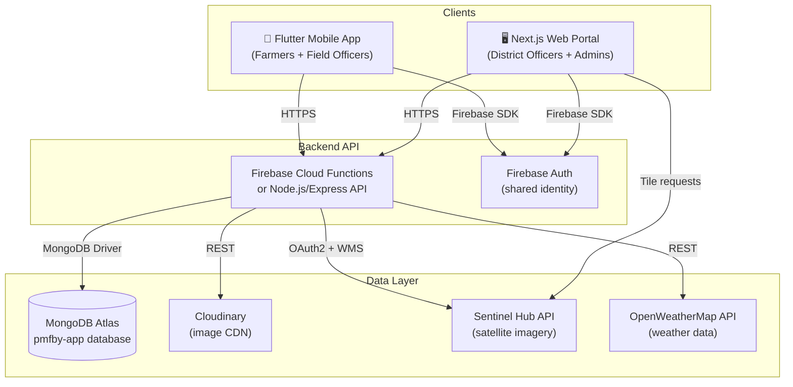

# WEB_PORTAL_PLAN.md — Krishi Bandhu Web Application Design

> **Based on:** [PROJECT_ANALYSIS.md](./PROJECT_ANALYSIS.md) · [ARCHITECTURE_REVIEW.md](./ARCHITECTURE_REVIEW.md) · [RN_MIGRATION_REPORT.md](./RN_MIGRATION_REPORT.md)  
> **Date:** 2026-07-12  
> **Premise:** The Flutter mobile app remains the primary client for farmers. The web portal serves officers and administrators who work from desktops in district and state offices.

---

## 1. Framework Recommendation: Next.js 15 (App Router)

### Choice: **Next.js** over plain React

| Factor | React (Vite SPA) | Next.js 15 (App Router) | Decision rationale |
|--------|-------------------|-------------------------|-------------------|
| SEO for public pages | Requires additional SSR setup | Built-in SSG/SSR per route | PMFBY info, scheme details, and premium calculator should be publicly indexable |
| Authentication middleware | Manual route guards in every component | `middleware.ts` intercepts at the edge, before render | Officers access sensitive claim/farmer data — auth must be enforced at the routing layer, not the component layer |
| Server Components | Not available | Default — data fetching runs server-side, only interactivity ships to the browser | Officer dashboard loads aggregate statistics from MongoDB — this data should never transit through the browser as raw queries |
| API Routes | Requires separate Express/Fastify server | `app/api/` routes co-located in the same project | The backend API layer (currently missing — see §3) can be built and deployed as part of the same Next.js project |
| File-based routing | Manual react-router config | Automatic from `app/` directory structure | 20+ routes map directly to folders — less boilerplate, fewer routing bugs |
| Streaming & Suspense | Available but manual | First-class with `loading.tsx` per route segment | Officer dashboard has multiple independent data panels (claims, stats, weather) — streaming lets each panel load independently |
| Deployment | Any static host | Vercel, self-hosted Node, Docker, or static export | Government deployments often require on-premise hosting — `next build && next start` runs on any Node server |

### Why not other frameworks

| Alternative | Assessment |
|-------------|------------|
| **Remix** | Strong data-loading model, but smaller ecosystem and weaker ISR support. The officer dashboard benefits from ISR for stats pages that update every few minutes. |
| **SvelteKit** | Excellent performance, but the team is invested in Dart (Flutter) — adding Svelte is a third paradigm. TypeScript/React is a more common adjacent skill. |
| **Angular** | Heavier setup, steeper learning curve, more boilerplate. No advantage for this use case. |
| **Flutter Web** | Already scaffolded in the repo. However, Flutter Web renders to `<canvas>` — it cannot render accessible HTML tables, is not indexable by search engines, and produces a 2–4 MB initial bundle. The officer dashboard is a data-heavy, table-heavy CRUD interface that is best served by native HTML. |

---

## 2. Prerequisite: Build the Backend API

> [!IMPORTANT]
> The web portal **cannot** be built until the direct-MongoDB-from-client problem identified in `ARCHITECTURE_REVIEW.md` §2.1 is resolved. The web and mobile apps must both talk to a backend API — never directly to MongoDB.

The current Flutter app connects to MongoDB Atlas via a TCP `mongo_dart` driver with credentials embedded in the APK. The web app must not replicate this pattern. Instead, both clients share a single backend API.

### Recommended backend: Firebase Cloud Functions + MongoDB Atlas

**Why Firebase Cloud Functions:**
- Firebase is already configured in the project (`firebase_core`, `firebase_auth`, `cloud_firestore` are all wired up)
- Cloud Functions deploy with `firebase deploy --only functions` — zero infrastructure provisioning
- Firebase Auth tokens are verified server-side natively
- The free Blaze plan supports outbound network calls to MongoDB Atlas

**Alternative:** A standalone Node.js/Express API deployed on Railway, Render, or a government-hosted VM. This is viable if the team prefers more control, but requires managing a server process, TLS certificates, and process monitoring.

### API surface (derived from existing repository methods)

The four Dart repositories (`FarmerRepository`, `CropImageRepository`, `CropLossRepository`, `AuthRepository`) plus `MongoDBService` feedback methods define the required API surface:

```
POST   /api/auth/login
POST   /api/auth/register
POST   /api/auth/verify-token
GET    /api/auth/me

GET    /api/farmers                    ?district=&limit=&skip=
GET    /api/farmers/:farmerId
POST   /api/farmers
PUT    /api/farmers/:farmerId
GET    /api/farmers/:farmerId/images
GET    /api/farmers/:farmerId/stats

GET    /api/claims                     ?status=&season=&farmerId=
GET    /api/claims/:claimId
POST   /api/claims
PUT    /api/claims/:claimId/status
PUT    /api/claims/:claimId/review

GET    /api/crop-images                ?status=&farmerId=&parcelId=
GET    /api/crop-images/:imageId
GET    /api/crop-images/pending-review ?limit=
GET    /api/crop-images/flagged
PUT    /api/crop-images/:imageId/ml-verification
PUT    /api/crop-images/:imageId/officer-verification

GET    /api/crop-loss                  ?status=&season=&year=
GET    /api/crop-loss/:lossId
POST   /api/crop-loss
PUT    /api/crop-loss/:lossId/status
PUT    /api/crop-loss/:lossId/assessment
GET    /api/crop-loss/stats            ?farmerId=&season=&year=

GET    /api/feedback                   ?status=&category=&priority=&limit=&skip=
GET    /api/feedback/:feedbackId
POST   /api/feedback
PUT    /api/feedback/:feedbackId/status
GET    /api/feedback/stats
```

This is a direct translation of the existing Dart repository methods into REST endpoints. The backend implements the same MongoDB queries that currently live in `crop_image_repository.dart`, `crop_loss_repository.dart`, `farmer_repository.dart`, and `mongodb_service.dart`.

---

## 3. Shared API Layer

### TypeScript API client (consumed by Next.js)

The web app uses a typed API client that mirrors the Dart models. These types are derived directly from the existing MongoDB document models in `lib/src/models/mongodb/`.

```typescript
// types/farmer.ts — mirrors farmer_model.dart
export interface Farmer {
  farmerId: string;
  name: { first: string; last: string };
  phone: string;
  aadhaar: { number: string; displayNumber: string; verified: boolean };
  address: {
    state: string;
    district: string;
    taluka: string;
    village: string;
    pincode: string;
  };
  landParcels: LandParcel[];
  createdAt: string;
  updatedAt: string;
}

// types/claim.ts — mirrors claim_model.dart
export interface Claim {
  claimId: string;
  farmerId: string;
  parcelId: string;
  season: string;
  submission: { images: string[]; submittedAt: string; submittedBy: string };
  aiAssessment: { confidence: number; damagePercentage: number; cropType: string; recommendation: string };
  humanReview: { officerId: string; decision: string; notes: string; reviewedAt: string };
  payout?: { amount: number; status: string; processedAt: string };
  status: 'PENDING' | 'REVIEW' | 'APPROVED' | 'REJECTED';
  createdAt: string;
  updatedAt: string;
}

// types/crop-image.ts — mirrors crop_image_model.dart
export interface CropImage {
  imageId: string;
  farmerId: string;
  parcelId: string;
  metadata: { width: number; height: number; sizeBytes: number; format: string };
  location: { latitude: number; longitude: number; accuracy: number };
  imageUrl: string;
  thumbnailUrl: string;
  imageType: 'sowing' | 'standing_crop' | 'harvest' | 'damage' | 'other';
  cropInfo: { name: string; variety: string; stage: string };
  mlVerification?: { confidence: number; cropDetected: string; healthScore: number; flags: string[] };
  officerVerification?: { officerId: string; verified: boolean; notes: string; verifiedAt: string };
  season: string;
  year: number;
  status: 'uploaded' | 'pendingMLVerification' | 'mlVerified' | 'pendingOfficerReview' | 'verified' | 'rejected' | 'flagged';
  capturedAt: string;
  uploadedAt: string;
}

// types/crop-loss.ts — mirrors crop_loss_model.dart
export interface CropLoss {
  lossId: string;
  farmerId: string;
  parcelId: string;
  season: string;
  year: number;
  lossDetails: {
    lossCause: string;
    affectedArea: number;
    estimatedLossPercentage: number;
    description: string;
  };
  imageIds: string[];
  officerAssessment?: {
    officerId: string;
    verifiedLossPercentage: number;
    notes: string;
    assessedAt: string;
  };
  status: 'reported' | 'assessed' | 'approved' | 'rejected';
  reportedAt: string;
}
```

### API client class

```typescript
// lib/api-client.ts
class PMFBYApiClient {
  private baseUrl: string;
  private token: string | null;

  constructor(baseUrl: string) { ... }

  // Auth
  async login(email: string, password: string): Promise<AuthResponse> { ... }
  async verifyToken(): Promise<User> { ... }

  // Claims — used by officer dashboard
  async getClaims(filters: ClaimFilters): Promise<PaginatedResult<Claim>> { ... }
  async reviewClaim(claimId: string, review: HumanReview): Promise<Claim> { ... }

  // Crop images — used by verification queue
  async getPendingImages(limit: number): Promise<CropImage[]> { ... }
  async verifyImage(imageId: string, verification: OfficerVerification): Promise<void> { ... }

  // Crop loss — used by assessment queue
  async getPendingAssessments(district?: string): Promise<CropLoss[]> { ... }
  async submitAssessment(lossId: string, assessment: OfficerAssessment): Promise<void> { ... }

  // Analytics — aggregation endpoints
  async getDashboardStats(scope: StatScope): Promise<DashboardStats> { ... }
  async getCropLossStats(filters: LossStatsFilters): Promise<LossStats> { ... }
  async getFeedbackStats(): Promise<FeedbackStats> { ... }
}
```

The same backend API serves both the Flutter app (after refactoring `mongo_dart` calls to HTTP calls) and the Next.js web portal. The API client class can be published as an npm package or shared via a monorepo.

---

## 4. Folder Structure

```
pmfby-web/
├── app/                                  # Next.js App Router
│   ├── layout.tsx                        # Root layout: theme provider, auth context, sidebar
│   ├── page.tsx                          # Landing / redirect to login
│   ├── loading.tsx                       # Global loading skeleton
│   ├── not-found.tsx                     # 404 page
│   │
│   ├── (public)/                         # Route group: no auth required
│   │   ├── login/page.tsx                # Officer/admin login
│   │   ├── pmfby-info/page.tsx           # Public PMFBY scheme info (SSG)
│   │   └── premium-calculator/page.tsx   # Public premium calculator (SSG)
│   │
│   ├── (officer)/                        # Route group: officer auth required
│   │   ├── layout.tsx                    # Sidebar + top bar + breadcrumbs
│   │   ├── dashboard/
│   │   │   ├── page.tsx                  # Officer dashboard overview
│   │   │   └── loading.tsx              # Streaming skeleton for stats panels
│   │   ├── claims/
│   │   │   ├── page.tsx                  # Claims list with filters + data table
│   │   │   └── [claimId]/page.tsx        # Claim detail + review form
│   │   ├── crop-images/
│   │   │   ├── page.tsx                  # Image verification queue
│   │   │   └── [imageId]/page.tsx        # Single image review (side-by-side ML + manual)
│   │   ├── crop-loss/
│   │   │   ├── page.tsx                  # Crop loss reports list
│   │   │   └── [lossId]/page.tsx         # Assessment form
│   │   ├── farmers/
│   │   │   ├── page.tsx                  # Farmer directory (searchable, paginated)
│   │   │   └── [farmerId]/page.tsx       # Farmer profile + land parcels + history
│   │   ├── satellite/page.tsx            # Satellite map (Leaflet / MapLibre GL)
│   │   ├── weather/page.tsx              # Weather dashboard
│   │   ├── district-efficiency/page.tsx  # Traffic-light gamified dashboard
│   │   ├── feedback/
│   │   │   ├── page.tsx                  # Feedback management table
│   │   │   └── [feedbackId]/page.tsx     # Feedback detail + admin response
│   │   └── reports/
│   │       ├── page.tsx                  # Report builder (export to CSV/PDF)
│   │       └── analytics/page.tsx        # Charts: claims over time, loss causes, payouts
│   │
│   ├── (admin)/                          # Route group: admin-only
│   │   ├── layout.tsx
│   │   ├── users/page.tsx                # User management (officers, admins)
│   │   ├── audit-log/page.tsx            # Audit trail viewer
│   │   └── settings/page.tsx             # System configuration
│   │
│   └── api/                              # API routes (if backend is co-located)
│       ├── auth/
│       │   ├── login/route.ts
│       │   ├── register/route.ts
│       │   └── me/route.ts
│       ├── claims/
│       │   ├── route.ts                  # GET (list) / POST (create)
│       │   └── [claimId]/
│       │       ├── route.ts              # GET / PUT
│       │       └── review/route.ts       # PUT (officer review)
│       ├── crop-images/
│       │   ├── route.ts
│       │   ├── pending-review/route.ts
│       │   └── [imageId]/
│       │       ├── route.ts
│       │       └── officer-verification/route.ts
│       ├── crop-loss/
│       │   ├── route.ts
│       │   ├── stats/route.ts
│       │   └── [lossId]/
│       │       ├── route.ts
│       │       └── assessment/route.ts
│       ├── farmers/
│       │   ├── route.ts
│       │   └── [farmerId]/
│       │       ├── route.ts
│       │       ├── images/route.ts
│       │       └── stats/route.ts
│       └── feedback/
│           ├── route.ts
│           ├── stats/route.ts
│           └── [feedbackId]/
│               └── status/route.ts
│
├── components/                           # Shared UI components
│   ├── ui/                               # Design system primitives
│   │   ├── button.tsx
│   │   ├── card.tsx
│   │   ├── data-table.tsx               # TanStack Table wrapper
│   │   ├── badge.tsx
│   │   ├── dialog.tsx
│   │   ├── dropdown-menu.tsx
│   │   ├── input.tsx
│   │   ├── select.tsx
│   │   ├── skeleton.tsx
│   │   ├── tabs.tsx
│   │   └── toast.tsx
│   ├── layout/
│   │   ├── sidebar.tsx                   # Collapsible navigation sidebar
│   │   ├── top-bar.tsx                   # Breadcrumbs + user menu + theme toggle
│   │   └── page-header.tsx              # Title + description + action buttons
│   ├── charts/
│   │   ├── claims-overview-chart.tsx     # Recharts area chart
│   │   ├── loss-cause-chart.tsx          # Recharts pie/bar chart
│   │   ├── district-heatmap.tsx          # Color-coded district grid
│   │   └── payout-trend-chart.tsx        # Recharts line chart
│   ├── maps/
│   │   ├── satellite-map.tsx            # Leaflet/MapLibre wrapper
│   │   ├── ndvi-layer.tsx               # Sentinel Hub NDVI tile layer
│   │   └── district-polygons.tsx        # GeoJSON district boundaries
│   ├── claims/
│   │   ├── claims-table.tsx             # Filterable, sortable claims data table
│   │   ├── claim-detail-card.tsx        # Claim summary with images
│   │   ├── review-form.tsx             # Officer review action form
│   │   └── claim-timeline.tsx           # Status history timeline
│   ├── images/
│   │   ├── image-grid.tsx               # Thumbnail grid with lightbox
│   │   ├── image-comparison.tsx         # Side-by-side: uploaded vs. ML annotated
│   │   └── verification-panel.tsx       # Approve/reject with notes
│   └── farmers/
│       ├── farmer-card.tsx              # Summary card (name, district, parcels)
│       ├── farmer-detail.tsx            # Full profile with tabs
│       └── land-parcel-map.tsx          # Individual parcel on map
│
├── lib/                                  # Shared logic
│   ├── api-client.ts                    # Typed API client (§3)
│   ├── auth.ts                          # Firebase Auth helpers + session management
│   ├── db.ts                            # MongoDB connection (server-side only)
│   ├── constants.ts                     # Premium rates, seasons, crop types, loss causes
│   ├── premium-calculator.ts            # Premium calculation logic (ported from Dart)
│   └── utils.ts                         # formatCurrency, formatDate, etc.
│
├── types/                                # TypeScript type definitions
│   ├── farmer.ts
│   ├── claim.ts
│   ├── crop-image.ts
│   ├── crop-loss.ts
│   ├── feedback.ts
│   ├── user.ts
│   └── api.ts                           # Request/response envelope types
│
├── hooks/                                # React hooks
│   ├── use-auth.ts                      # Auth context consumer
│   ├── use-claims.ts                    # TanStack Query wrapper for claims
│   ├── use-farmers.ts
│   ├── use-crop-images.ts
│   └── use-debounce.ts
│
├── styles/
│   ├── globals.css                      # CSS variables, reset, theme tokens
│   └── data-table.css                   # Table-specific styles
│
├── public/
│   ├── logo.svg
│   └── favicon.ico
│
├── middleware.ts                         # Auth check: redirect unauthenticated to /login
├── next.config.ts
├── tailwind.config.ts                   # Only if team opts into Tailwind
├── tsconfig.json
└── package.json
```

---

## 5. Authentication

### Strategy: Firebase Auth + Next.js Middleware + HTTP-only Session Cookies

**Why Firebase Auth:** It's already configured in the Flutter project. Using the same Firebase project means the same user accounts work on both mobile and web. No separate identity system.

### Flow

```
Browser → /login → Firebase Auth (signInWithEmailAndPassword)
       → Firebase returns ID token (JWT)
       → POST /api/auth/session (sends ID token)
       → Server verifies ID token via Firebase Admin SDK
       → Server sets HTTP-only secure session cookie (7-day expiry)
       → Redirect to /dashboard

Subsequent requests:
Browser → middleware.ts reads session cookie
       → Verifies cookie via Firebase Admin SDK
       → Attaches user UID + role to request headers
       → Route handler reads role from headers for RBAC
```

### middleware.ts

```typescript
import { NextRequest, NextResponse } from 'next/server';

const publicPaths = ['/login', '/pmfby-info', '/premium-calculator'];

export function middleware(request: NextRequest) {
  const session = request.cookies.get('session')?.value;
  const { pathname } = request.nextUrl;

  // Allow public routes
  if (publicPaths.some(p => pathname.startsWith(p))) {
    return NextResponse.next();
  }

  // Redirect to login if no session
  if (!session) {
    return NextResponse.redirect(new URL('/login', request.url));
  }

  // Session verification happens in layout.tsx (server component)
  return NextResponse.next();
}

export const config = {
  matcher: ['/((?!_next/static|_next/image|favicon.ico|api/auth).*)'],
};
```

### Role-Based Access Control

| Role | Routes | Permissions |
|------|--------|-------------|
| `officer` | `/dashboard`, `/claims`, `/crop-images`, `/crop-loss`, `/farmers`, `/satellite`, `/weather`, `/feedback` | View all data in assigned district, review claims, verify images, submit assessments |
| `admin` | All officer routes + `/users`, `/audit-log`, `/settings`, `/reports` | All officer permissions + manage users, view audit logs, export data, system configuration |
| `farmer` | `/pmfby-info`, `/premium-calculator` (public only) | Farmers use the mobile app. Web access is limited to public informational pages. |

### Why farmers don't get full web access

The mobile app is purpose-built for the farmer use case: camera for crop photos, GPS for location, offline queue for low-connectivity areas, voice guidance for low-literacy users. A web dashboard would be a downgrade. Public pages (scheme info, premium calculator) are available to everyone without login.

---

## 6. Responsive UX Strategy

### Design philosophy: Desktop-first, responsive down to tablet

The primary user of the web portal is a district officer sitting at a desk with a 14–24" monitor. The design optimizes for:
- **Data density** — officers need to see many claims/images at once, not one at a time
- **Keyboard navigation** — bulk review of 50+ claims per session
- **Side-by-side comparison** — ML assessment vs. officer judgment
- **Multi-panel layouts** — dashboard with 4–6 simultaneous data panels

### Breakpoints

| Breakpoint | Target | Layout |
|-----------|--------|--------|
| ≥1280px | Desktop (primary) | Sidebar + main content + optional detail panel |
| 1024–1279px | Small desktop / large tablet | Collapsible sidebar, single main column |
| 768–1023px | Tablet | Hidden sidebar (hamburger), stacked panels |
| <768px | Mobile | Single column, simplified tables become cards |

### Navigation structure

```
┌─────────────────────────────────────────────────────────────┐
│ Top Bar: [Logo] [Breadcrumb: Dashboard > Claims > CLM-001] │
│          [Search] [Notifications] [Language] [User Menu]    │
├──────┬──────────────────────────────────────────────────────┤
│      │                                                      │
│ Side │   Main Content Area                                  │
│ bar  │                                                      │
│      │   ┌──────────────────┐  ┌──────────────────┐        │
│ 📊   │   │ Pending Claims   │  │ Recent Alerts    │        │
│ 📋   │   │ 342              │  │ 5 new crop loss  │        │
│ 📷   │   └──────────────────┘  └──────────────────┘        │
│ 🌾   │                                                      │
│ 👨‍🌾  │   ┌──────────────────────────────────────────┐      │
│ 🛰️   │   │ Claims Data Table                         │      │
│ ☁️   │   │ [Filter] [Search] [Export CSV]             │      │
│ 📝   │   │ ID | Farmer | Crop | Amount | Status | ▼  │      │
│ 📈   │   │ ──────────────────────────────────────── │      │
│      │   │ CLM-001 | Ram Singh | Wheat | ₹45K | ⏳  │      │
│      │   └──────────────────────────────────────────┘      │
├──────┴──────────────────────────────────────────────────────┤
│ Status Bar: [Online ●] [Last sync: 2 min ago] [v1.0.0]     │
└─────────────────────────────────────────────────────────────┘
```

### Component library approach

Build from scratch using CSS variables. The design system tokens mirror the Flutter app's Material 3 theme:

```css
/* globals.css */
:root {
  --color-primary: #2E7D32;        /* Deep Green — matches Flutter primarySeedColor */
  --color-secondary: #FFA000;      /* Amber — matches Flutter secondaryColor */
  --color-surface: #FFFFFF;
  --color-surface-variant: #F5F5F5;
  --color-on-primary: #FFFFFF;
  --color-error: #D32F2F;
  --color-success: #388E3C;
  --color-warning: #F57C00;

  --font-display: 'Poppins', sans-serif;   /* Matches Flutter GoogleFonts.poppins */
  --font-body: 'Noto Sans', sans-serif;    /* Matches Flutter GoogleFonts.notoSans */
  --font-mono: 'Roboto Mono', monospace;

  --radius-sm: 8px;
  --radius-md: 12px;                       /* Matches Flutter BorderRadius.circular(12) */
  --radius-lg: 16px;

  --shadow-sm: 0 1px 2px rgba(0,0,0,0.05);
  --shadow-md: 0 4px 6px rgba(0,0,0,0.07);
}

[data-theme="dark"] {
  --color-surface: #121212;
  --color-surface-variant: #1E1E1E;
  --color-on-primary: #000000;
}
```

### Key library recommendations

| Need | Library | Rationale |
|------|---------|-----------|
| Data tables | TanStack Table v8 | Headless — full styling control; sorting, filtering, pagination, column resizing built-in |
| Charts | Recharts | React-based, composable, SSR-compatible. Replaces `fl_chart` |
| Maps | Leaflet via `react-leaflet` or MapLibre GL JS | Matches Flutter app's `flutter_map` (both use OpenStreetMap tiles). Sentinel Hub WMS/WMTS tile layers work identically |
| Data fetching | TanStack Query v5 | Caching, background refetching, optimistic updates, pagination. Replaces direct `fetch` calls |
| Forms | React Hook Form + Zod | Type-safe validation. Used for claim review forms, assessment forms, farmer search |
| Date handling | `date-fns` | Lightweight. `intl` replacement |
| Icons | Lucide React | Clean, consistent icon set |
| Toasts | Sonner | Lightweight, accessible toast notifications |

---

## 7. Feature Parity Matrix

### Features present on both mobile and web

| Feature | Mobile (Flutter) | Web (Next.js) | Scope difference |
|---------|-----------------|---------------|-----------------|
| **Dashboard** | Farmer dashboard (action grid, weather card, sync badge) | Officer dashboard (stats panels, charts, recent claims table, alerts) | Different roles, different views. The web dashboard is analytics-heavy; the mobile dashboard is action-heavy. |
| **Claims list** | Tab view (All/Active/Approved/History) with demo data | Sortable, filterable data table with real data, pagination, CSV export | Web has bulk actions (approve/reject multiple), column customization, advanced filters |
| **Claim detail** | Read-only claim card with status chip | Full review form: approve/reject, notes, damage assessment, image review, payout trigger | Web is the primary claim adjudication interface |
| **Crop images** | Camera capture → preview → upload | Image verification queue with thumbnail grid, side-by-side ML vs. manual comparison | Web is for reviewing images, not capturing them |
| **Crop loss** | Two-screen intimation form with GPS + photo | Assessment queue: view reports, field photos, submit assessment with verified loss percentage | Web is for assessing reports filed from mobile |
| **Farmer directory** | Profile screen for logged-in farmer | Searchable, paginated table of all farmers in assigned district with detail drill-down | Web gives officers a view across all farmers |
| **Satellite map** | flutter_map with NDVI/EVI layers, district polygons | Leaflet/MapLibre with same Sentinel Hub tile layers, NDVI stats, district boundaries | Nearly identical — same data source, same tile layers, different rendering library |
| **Weather** | GPS-based current weather + forecast | District-level weather for officer's assigned area | Web shows weather for the managed district, not personal location |
| **Premium calculator** | Form with state/district/crop selectors | Same form, SSG'd as a public page | Identical logic, ported from Dart to TypeScript |
| **PMFBY info** | Scheme info screen | Public SSG page with search | Identical content, web version is SEO-optimized |
| **Feedback management** | Farmer submits feedback/complaints | Admin reads, responds, changes status, views statistics | Web is the admin side; mobile is the submission side |
| **District efficiency** | Traffic-light animated cards | Data table + heatmap with sortable metrics | Web is more data-dense, less animated |
| **Language settings** | 16 Indian language selector + ML Kit on-device translation | Hindi/English toggle (officer-facing — fewer languages needed) | Web serves officers who primarily use Hindi or English |
| **Schemes** | Scheme listing with detail cards | Same content, SSG | Identical |

---

## 8. Mobile-Only Features

These features **do not belong on the web** — they depend on mobile hardware or mobile-specific OS APIs.

| Feature | Why mobile-only |
|---------|----------------|
| **AR Camera** (validation engine, tilt detection, quality analysis, ghost frame) | Requires device camera viewfinder, accelerometer sensor fusion, real-time YUV frame processing. No web equivalent. |
| **Multi-image capture + batch upload** | Camera-dependent. Officers don't capture images — they review images captured by farmers. |
| **Offline queue + background sync** (WorkManager, LocalStorageService) | Web assumes always-online. Service Workers could provide limited offline, but the cost/benefit doesn't justify it for desk-bound officers. |
| **GPS-tagged image capture** | Location is embedded at capture time on the phone. Web reviews the embedded metadata. |
| **ML Kit on-device translation** (40+ languages, no internet) | ML Kit is a mobile SDK. Web can use Google Cloud Translation API (online-only), but officers in district offices have internet. |
| **Local notifications** (flutter_local_notifications) | Officers receive email alerts or browser notifications via the Notifications API — a different mechanism. |

---

## 9. Web-Only Features

These features **only make sense on the web** — they leverage desktop screen real estate, keyboard input, or server-side processing.

| Feature | Rationale |
|---------|-----------|
| **Bulk data export** (CSV/PDF for claims, farmers, crop loss reports) | Officers need to generate monthly/quarterly reports for state-level reporting. Export to CSV for spreadsheet analysis, PDF for printed submissions. |
| **Side-by-side claim comparison** | Two-panel layout: ML assessment result on the left, uploaded photo + officer notes on the right. Not feasible on a 6" phone screen. |
| **Keyboard shortcuts** | `j`/`k` to navigate claims list, `a` to approve, `r` to reject, `Enter` to submit review. Bulk review of 50+ claims per session. |
| **Multi-tab claim workflow** | Open 3–4 claims in separate browser tabs for comparison. Mobile can only show one claim at a time. |
| **Audit log viewer** | Paginated, searchable table of all administrative actions: who approved which claim, who changed what status, when. Admin compliance requirement. |
| **Advanced data tables** | Column resizing, column reordering, multi-column sort, saved filter presets, row selection for bulk actions. TanStack Table capabilities that don't fit mobile UX. |
| **Print-optimized claim reports** | `@media print` CSS for generating formatted claim summaries that officers can print and attach to physical files (still required by many district offices). |

---

## 10. Build Sequence

### Phase 1 — Foundation (Weeks 1–3)

**Backend API:**
- Set up Firebase Cloud Functions project (or Express API)
- Implement auth endpoints (login, verify-token, session cookie)
- Implement `/api/claims` and `/api/feedback` endpoints (highest officer value)
- Connect to existing MongoDB Atlas (same cluster the Flutter app uses)

**Next.js scaffold:**
- `npx create-next-app@latest` with App Router, TypeScript
- Design system: CSS variables, typography, color tokens matching Flutter theme
- `middleware.ts` with Firebase session cookie verification
- Sidebar layout component
- Login page with Firebase Auth

### Phase 2 — Officer Core (Weeks 4–7)

- Officer dashboard (stats panels with streaming/suspense)
- Claims data table (TanStack Table, filters, pagination)
- Claim detail page with review form
- Crop image verification queue
- Feedback management table

### Phase 3 — Maps + Analytics (Weeks 8–11)

- Satellite map (Leaflet + Sentinel Hub tile layers)
- Weather dashboard
- District efficiency heatmap
- Analytics page (Recharts: claims over time, loss causes, payout trends)
- Crop loss assessment queue

### Phase 4 — Admin + Polish (Weeks 12–14)

- Farmer directory with detail drill-down
- Bulk export (CSV/PDF)
- Audit log viewer
- Admin user management
- Keyboard shortcuts
- Print stylesheet for claim reports
- Responsive polish for tablet breakpoint
- Public pages: PMFBY info (SSG), Premium calculator (SSG)

---

## Architecture Diagram



Both clients talk to the same backend API, which is the only component with database credentials. Firebase Auth provides a unified identity layer across mobile and web. Sentinel Hub tile requests can go directly from the browser to the Sentinel Hub WMS endpoint (authenticated via a backend-issued short-lived token, or via a proxy endpoint in the API).

---

*This plan is a design document. No code was written or modified. Implementation should begin only after the Phase 1 refactors from `ARCHITECTURE_REVIEW.md` (credential rotation, backend API, auth consolidation) are complete — the web portal depends on the same backend API that replaces the direct MongoDB connection.*
