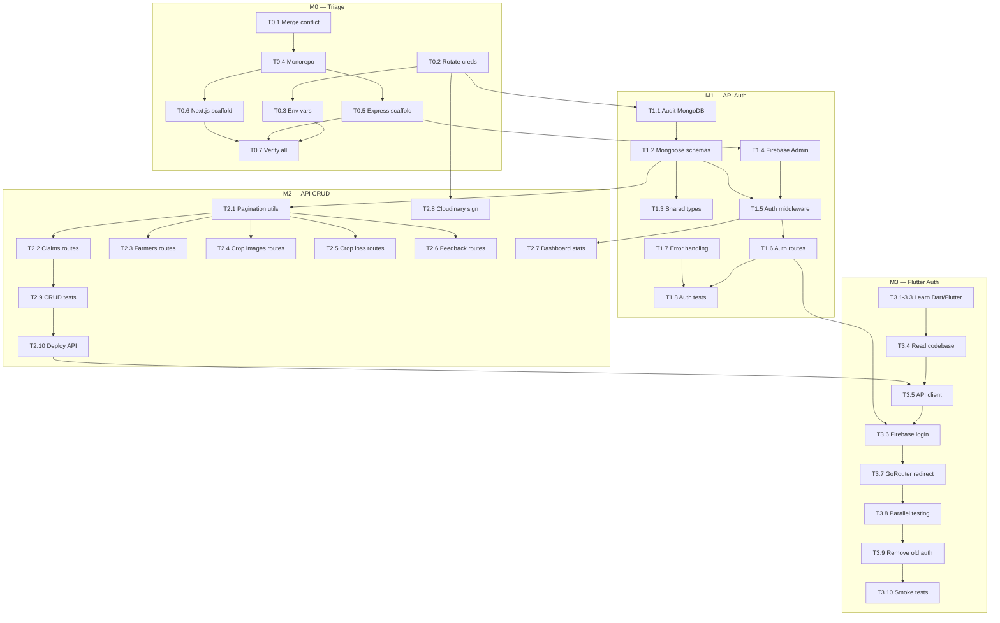

# WORK_PACKAGES.md — Detailed Task Breakdown

> **Parent:** [PROJECT_ROADMAP.md](./PROJECT_ROADMAP.md)  
> **Rule:** Every task should be completable in a single sitting (1–4 hours). No task exceeds 5 hours. If a task feels larger, it hasn't been decomposed enough.

---

## How to Read This Document

Each task is formatted as:

> **T{milestone}.{number} — {name}**
>
> | Field | Value |
> |-------|-------|
> | Goal | What this task accomplishes |
> | Effort | Hours |
> | Requires | Knowledge you need before starting |
> | Learn | Resources if you don't have the knowledge (skip if you do) |
> | Depends on | Other tasks that must be complete first |
> | Done when | Concrete, verifiable condition |

At the end of each milestone, a **parallelization map** shows which tasks can overlap.

---

# M0 — Triage & Monorepo Setup

**Week 1 · 7 tasks · ~10 hours**

---

### T0.1 — Resolve Git Merge Conflict

| Field | Value |
|-------|-------|
| **Goal** | Fix the `<<<<<<< HEAD` / `=======` / `>>>>>>>` markers in `main.dart` so the file compiles. The correct resolution includes the `DistrictEfficiencyScreen` route from the incoming branch. |
| **Effort** | 0.5 hrs |
| **Requires** | Basic git conflict resolution |
| **Learn** | [Git docs: resolving conflicts](https://git-scm.com/book/en/v2/Git-Branching-Basic-Merging) — 10 min read |
| **Depends on** | Nothing |
| **Done when** | `flutter analyze lib/main.dart` reports zero errors. `grep -n "<<<<<<" lib/main.dart` returns nothing. The route table includes `DistrictEfficiencyScreen`. |

---

### T0.2 — Rotate Compromised Credentials

| Field | Value |
|-------|-------|
| **Goal** | Generate new credentials for every service whose secrets are in the source code. Revoke all old credentials. |
| **Effort** | 2 hrs |
| **Requires** | Account access to: MongoDB Atlas, Cloudinary, OpenWeatherMap, the SMTP provider |
| **Learn** | Each service's dashboard — no tutorials needed, just navigate to API Keys / Security |
| **Depends on** | Nothing |
| **Done when** | Old MongoDB password no longer connects. Old Cloudinary key returns 401. Old OWM key returns 401. New credentials stored in a local `.env` file (not committed). |

---

### T0.3 — Environment Variable Injection for Flutter

| Field | Value |
|-------|-------|
| **Goal** | Replace every hardcoded credential in Dart source files with a `--dart-define` variable. The app reads credentials from compile-time constants, not string literals. |
| **Effort** | 2 hrs |
| **Requires** | Understanding of `--dart-define` and `const String.fromEnvironment()` in Dart |
| **Learn** | [Flutter docs: compile-time variables](https://dart.dev/guides/language/language-tour#using-constructors) — search for `String.fromEnvironment`. [Blog: using --dart-define](https://iiro.dev/dart-define/) — 5 min read |
| **Depends on** | T0.2 (new credentials exist to inject) |
| **Done when** | `grep -rn "rohan123\|mongodb+srv://\|cloudinary.*api_secret\|smtp.*password" lib/` returns zero results. The app launches with `flutter run --dart-define=MONGODB_URI=...`. |

---

### T0.4 — Initialize Monorepo Structure

| Field | Value |
|-------|-------|
| **Goal** | Reorganize the repository into a monorepo with `apps/mobile`, `apps/web`, `packages/server`, `packages/shared-types`. Move the existing Flutter project into `apps/mobile/`. |
| **Effort** | 1.5 hrs |
| **Requires** | npm workspaces, basic knowledge of monorepo layout |
| **Learn** | [npm workspaces docs](https://docs.npmjs.com/cli/v10/using-npm/workspaces) — 10 min read. No fancy tooling (no turborepo, no nx). |
| **Depends on** | T0.1 (merge conflict resolved before moving files) |
| **Done when** | The directory structure matches the spec. A root `package.json` has `"workspaces": ["apps/*", "packages/*"]`. The Flutter project in `apps/mobile/` compiles with `flutter run`. `.gitignore` includes `.env*`, `node_modules/`. |

---

### T0.5 — Scaffold Express API Project

| Field | Value |
|-------|-------|
| **Goal** | Create the Express project in `packages/server/` with TypeScript, a health check endpoint, and the basic file structure. |
| **Effort** | 1.5 hrs |
| **Requires** | Express, TypeScript setup (`tsconfig.json`, `tsx` or `ts-node` for dev) |
| **Learn** | You know Express. For TypeScript config: [TSConfig reference](https://www.typescriptlang.org/tsconfig) |
| **Depends on** | T0.4 (monorepo structure exists) |
| **Done when** | `npm run dev` from `packages/server/` starts the server. `curl localhost:4000/health` returns `{"status":"ok"}`. TypeScript compiles without errors. |

---

### T0.6 — Scaffold Next.js Project

| Field | Value |
|-------|-------|
| **Goal** | Create the Next.js 15 project in `apps/web/` with App Router and TypeScript. Default landing page renders. |
| **Effort** | 1.5 hrs |
| **Requires** | `npx create-next-app@latest` flags |
| **Learn** | [Next.js getting started](https://nextjs.org/docs/getting-started/installation) — 5 min. Run with `--help` first to see non-interactive flags. |
| **Depends on** | T0.4 (monorepo structure exists) |
| **Done when** | `npm run dev` from `apps/web/` starts the Next.js dev server. `localhost:3000` renders the default page. TypeScript strict mode enabled in `tsconfig.json`. |

---

### T0.7 — Verify All Projects Run

| Field | Value |
|-------|-------|
| **Goal** | Confirm that all three projects (Flutter, Express, Next.js) start without errors from their respective directories. Document the start commands in a root-level `DEVELOPMENT.md`. |
| **Effort** | 1 hr |
| **Requires** | Nothing beyond the previous tasks |
| **Learn** | N/A |
| **Depends on** | T0.3, T0.5, T0.6 |
| **Done when** | All three projects start. `DEVELOPMENT.md` lists the start command for each. A single `git commit` captures the complete monorepo setup. |

---

### M0 Parallelization

```
T0.1 ─────┐
           ├──→ T0.4 ──→ T0.5 ──┐
T0.2 ──→ T0.3                    ├──→ T0.7
                    T0.6 ────────┘

Parallel pairs:
• T0.1 and T0.2 (independent)
• T0.5 and T0.6 (both depend on T0.4, not on each other)
```

---

# M1 — Express API: Auth & Schemas

**Weeks 2–3 · 8 tasks · ~22 hours**

---

### T1.1 — Audit Existing MongoDB Documents

| Field | Value |
|-------|-------|
| **Goal** | Query each MongoDB collection directly (via Atlas Data Explorer or `mongosh`) and document the actual field names, types, and nesting structure of real documents. Compare against the Dart `toMap()` / `fromMap()` methods. Record any drift. |
| **Effort** | 3 hrs |
| **Requires** | MongoDB Atlas account access, ability to read Dart `Map<String, dynamic>` structures |
| **Learn** | [MongoDB Atlas Data Explorer](https://www.mongodb.com/docs/atlas/atlas-ui/documents/) — navigate to Browse Collections in Atlas |
| **Depends on** | T0.2 (you need the new MongoDB credentials) |
| **Done when** | You have a document (can be a markdown file or spreadsheet) listing every field in every collection, with the actual type observed in the database. Any mismatch between Dart models and actual documents is noted. |

---

### T1.2 — Define Mongoose Schemas

| Field | Value |
|-------|-------|
| **Goal** | Write Mongoose schema definitions for all 6 collections: `Farmer`, `Official`, `CropImage`, `Claim`, `CropLoss`, `FeedbackReport`. Each schema matches the actual MongoDB document shape from T1.1. |
| **Effort** | 4 hrs |
| **Requires** | Mongoose schema definition, TypeScript generics for Mongoose |
| **Learn** | [Mongoose TypeScript guide](https://mongoosejs.com/docs/typescript.html) — 15 min read. [Mongoose SchemaTypes](https://mongoosejs.com/docs/schematypes.html) |
| **Depends on** | T1.1 (actual document shapes documented) |
| **Done when** | Each schema file exists in `packages/server/src/models/`. A test script that reads one document from each collection via Mongoose and logs it without validation errors. No `Schema.Types.Mixed` or `any` used for known fields. |

---

### T1.3 — Create Shared TypeScript Interfaces

| Field | Value |
|-------|-------|
| **Goal** | Create TypeScript interfaces in `packages/shared-types/` that mirror each Mongoose schema. These will be imported by both `packages/server` and `apps/web`. |
| **Effort** | 2 hrs |
| **Requires** | TypeScript interfaces, npm workspace cross-package imports |
| **Learn** | [TypeScript handbook: interfaces](https://www.typescriptlang.org/docs/handbook/2/objects.html) — you likely know this already |
| **Depends on** | T1.2 (schemas define the canonical shape) |
| **Done when** | `packages/shared-types/src/index.ts` exports `Farmer`, `Claim`, `CropImage`, `CropLoss`, `FeedbackReport`, `Official`, and API envelope types (`PaginatedResult<T>`, `ApiError`). Both `server` and `web` projects can `import { Farmer } from '@pmfby/shared-types'` without errors. |

---

### T1.4 — Set Up Firebase Admin SDK

| Field | Value |
|-------|-------|
| **Goal** | Initialize the Firebase Admin SDK in the Express server. Verify it can decode a Firebase ID token. |
| **Effort** | 2 hrs |
| **Requires** | Firebase Console access, understanding of service account JSON files |
| **Learn** | [Firebase Admin setup for Node.js](https://firebase.google.com/docs/admin/setup) — 10 min. [Verify ID tokens](https://firebase.google.com/docs/auth/admin/verify-id-tokens) — 10 min. |
| **Depends on** | T0.5 (Express project exists) |
| **Done when** | `admin.auth().verifyIdToken(token)` successfully decodes a test ID token obtained from the Flutter app or Firebase Auth REST API. The service account JSON is loaded from an environment variable, not committed to git. |

---

### T1.5 — Build Auth Middleware

| Field | Value |
|-------|-------|
| **Goal** | Create Express middleware that extracts the `Authorization: Bearer <token>` header, verifies the ID token via Firebase Admin SDK, and attaches `uid` and `role` to `req.user`. Requests without a valid token receive `401`. |
| **Effort** | 3 hrs |
| **Requires** | Express middleware pattern, Firebase token verification from T1.4 |
| **Learn** | [Express middleware guide](https://expressjs.com/en/guide/using-middleware.html) — you know this. For role extraction: the user's role is determined by looking up their `uid` in the `farmers` or `officials` MongoDB collection. |
| **Depends on** | T1.4 (Admin SDK initialized), T1.2 (Farmer/Official schemas exist to look up role) |
| **Done when** | A request with a valid Firebase token hits any protected route and `req.user` contains `{ uid, role, name, district }`. A request with no token or an expired token receives `{ error: "Unauthorized", status: 401 }`. |

---

### T1.6 — Build Auth Routes

| Field | Value |
|-------|-------|
| **Goal** | Create two auth endpoints: `POST /api/auth/session` (verify token, return user profile from MongoDB) and `GET /api/auth/me` (return current user from verified token). |
| **Effort** | 2 hrs |
| **Requires** | T1.5 (auth middleware), Mongoose queries |
| **Learn** | N/A — standard Express route handlers |
| **Depends on** | T1.5 |
| **Done when** | `POST /api/auth/session` with a valid ID token returns the user's full profile (farmer or officer) from MongoDB. `GET /api/auth/me` with the same token returns the same profile. Both return `401` for invalid tokens. Tested with Postman or httpie. |

---

### T1.7 — Build Error Handling Middleware

| Field | Value |
|-------|-------|
| **Goal** | Create a centralized Express error handler that catches all unhandled errors and returns a consistent JSON shape: `{ error: string, status: number, details?: any }`. Handle Mongoose validation errors (400), Firebase auth errors (401), not-found (404), and unexpected errors (500). |
| **Effort** | 2 hrs |
| **Requires** | Express error-handling middleware (4-argument function) |
| **Learn** | [Express error handling](https://expressjs.com/en/guide/error-handling.html) — 5 min read |
| **Depends on** | T0.5 (Express project exists) |
| **Done when** | A Mongoose validation error returns `400` with the field-level error messages. An unhandled exception returns `500` with a generic message (no stack trace in response). The error shape is consistent across all routes. |

---

### T1.8 — Write Auth Tests

| Field | Value |
|-------|-------|
| **Goal** | Write 5–8 tests for the auth middleware and routes: valid token, expired token, missing token, malformed token, token for non-existent user, valid token with farmer role, valid token with officer role. |
| **Effort** | 4 hrs |
| **Requires** | Jest, Supertest, mocking Firebase Admin SDK |
| **Learn** | [Supertest with Express](https://github.com/ladjs/supertest#readme) — 10 min. For mocking Firebase: use `jest.mock('firebase-admin/auth')` to return controlled decoded tokens without making real Firebase calls. |
| **Depends on** | T1.5, T1.6, T1.7 (all auth code exists) |
| **Done when** | `npm test` in `packages/server/` runs 5+ auth tests and all pass. Tests do not call real Firebase (mocked). Tests do not require a real MongoDB connection (use an in-memory MongoDB via `mongodb-memory-server` or mock Mongoose). |

---

### M1 Parallelization

```
T1.1 ──→ T1.2 ──→ T1.3
                     │
T1.4 ──→ T1.5 ──→ T1.6 ──→ T1.8
                     │
T1.7 ────────────────┘

Parallel pairs:
• T1.1 and T1.4 (schema audit and Firebase setup are independent)
• T1.3 and T1.5 (shared-types and auth middleware are independent)
• T1.7 can be done anytime after T0.5
```

---

# M2 — Express API: CRUD & Aggregation

**Weeks 4–6 · 10 tasks · ~38 hours**

---

### T2.1 — Pagination & Filtering Utilities

| Field | Value |
|-------|-------|
| **Goal** | Create reusable helper functions: `parsePagination(req)` returns `{ page, limit, skip }`. `parseFilters(req, allowedFields)` returns a Mongoose filter object from query params. These are used by every list endpoint. |
| **Effort** | 2 hrs |
| **Requires** | Express `req.query`, Mongoose query construction |
| **Learn** | N/A — straightforward utility functions |
| **Depends on** | T0.5 (Express project exists) |
| **Done when** | `GET /api/anything?page=2&limit=20&status=PENDING` correctly produces `{ skip: 20, limit: 20, filter: { status: "PENDING" } }`. Edge cases handled: negative page defaults to 1, limit capped at 100. |

---

### T2.2 — Claims Routes

| Field | Value |
|-------|-------|
| **Goal** | Build CRUD routes for the `claims` collection: list with filters (status, season, farmerId), get by ID, create, update status, submit officer review. |
| **Effort** | 5 hrs |
| **Requires** | Mongoose CRUD, the `Claim` schema from T1.2, auth middleware from T1.5 |
| **Learn** | [Mongoose queries](https://mongoosejs.com/docs/queries.html) — reference doc |
| **Depends on** | T1.2, T1.5, T2.1 |
| **Done when** | All 5 routes return correct data when tested with Postman against the real MongoDB. `PUT /:id/review` updates the `humanReview` field and changes `status` to the officer's decision. The list endpoint paginates and filters correctly. |

---

### T2.3 — Farmers Routes

| Field | Value |
|-------|-------|
| **Goal** | Build routes for the `farmers` collection: list with district filter, get by ID, create, update, get farmer's images, get farmer stats (claim count, total area, etc.). |
| **Effort** | 4 hrs |
| **Requires** | Same as T2.2 |
| **Learn** | N/A |
| **Depends on** | T1.2, T1.5, T2.1 |
| **Done when** | `GET /api/farmers?district=Meerut&page=1` returns paginated farmers. `GET /api/farmers/:id/stats` returns an aggregated summary. All routes require auth. |

---

### T2.4 — Crop Images Routes

| Field | Value |
|-------|-------|
| **Goal** | Build routes for the `crop_images` collection: list with filters, get by ID, get pending review queue, get flagged images, submit officer verification. |
| **Effort** | 4 hrs |
| **Requires** | Same as T2.2 |
| **Learn** | N/A |
| **Depends on** | T1.2, T1.5, T2.1 |
| **Done when** | `GET /api/crop-images/pending-review?limit=20` returns images with status `pendingOfficerReview`. `PUT /:id/officer-verification` updates the verification record and changes the image status. |

---

### T2.5 — Crop Loss Routes

| Field | Value |
|-------|-------|
| **Goal** | Build routes for the `crop_loss_intimations` collection: list, get by ID, create, update status, submit assessment, get aggregated stats. |
| **Effort** | 3.5 hrs |
| **Requires** | Same as T2.2. Aggregation pipeline for stats route. |
| **Learn** | [Mongoose aggregation](https://mongoosejs.com/docs/api/aggregate.html) — reference doc |
| **Depends on** | T1.2, T1.5, T2.1 |
| **Done when** | `GET /api/crop-loss/stats?season=Kharif&year=2026` returns aggregated loss data (total affected area, count by cause, average loss percentage). |

---

### T2.6 — Feedback Routes

| Field | Value |
|-------|-------|
| **Goal** | Build routes for the `feedback_reports` collection: list with filters (status, category, priority), get by ID, create, update status, get stats. |
| **Effort** | 3 hrs |
| **Requires** | Same as T2.2 |
| **Learn** | N/A |
| **Depends on** | T1.2, T1.5, T2.1 |
| **Done when** | `POST /api/feedback` creates a new feedback record. `PUT /:id/status` updates the status. `GET /api/feedback/stats` returns counts by status and category. |

---

### T2.7 — Dashboard Aggregation Route

| Field | Value |
|-------|-------|
| **Goal** | Build `GET /api/dashboard/stats` that returns the officer dashboard's stat card data: total claims by status, total farmers, total premium value, recent 5 claims. This replaces the hardcoded demo data in the Flutter officer dashboard. |
| **Effort** | 3 hrs |
| **Requires** | MongoDB aggregation pipeline (`$group`, `$count`, `$sort`, `$limit`) |
| **Learn** | [MongoDB Aggregation Pipeline](https://www.mongodb.com/docs/manual/core/aggregation-pipeline/) — read the `$group` and `$facet` sections |
| **Depends on** | T1.2 (schemas), T1.5 (auth — dashboard is role-restricted) |
| **Done when** | The route returns a JSON object with real numbers: `{ totalClaims, pendingClaims, approvedClaims, totalFarmers, totalPremium, recentClaims: [...] }`. Numbers match what you see when querying MongoDB directly. |

---

### T2.8 — Cloudinary Signed Upload Endpoint

| Field | Value |
|-------|-------|
| **Goal** | Build `POST /api/uploads/sign` that generates a Cloudinary signed upload URL. The Flutter app calls this endpoint before uploading an image, so it never holds the Cloudinary API secret. |
| **Effort** | 2.5 hrs |
| **Requires** | Cloudinary Node.js SDK, signed upload concept |
| **Learn** | [Cloudinary signed uploads](https://cloudinary.com/documentation/upload_images#signed_uploads) — 10 min read. [Cloudinary Node.js SDK](https://cloudinary.com/documentation/node_integration) |
| **Depends on** | T0.2 (Cloudinary credentials rotated and available as env var), T1.5 (auth — only authenticated users can request upload URLs) |
| **Done when** | `POST /api/uploads/sign` returns `{ signature, timestamp, apiKey, cloudName, uploadPreset }`. Using these values, an image can be uploaded to Cloudinary from any HTTP client. The Cloudinary API secret is never sent to the client. |

---

### T2.9 — Write CRUD Tests

| Field | Value |
|-------|-------|
| **Goal** | Write 10–12 tests covering the critical CRUD paths: create a claim, list claims with filter, review a claim (status change), get dashboard stats, create feedback, get farmer with stats. |
| **Effort** | 5 hrs |
| **Requires** | Jest, Supertest, `mongodb-memory-server` (or test against a dedicated test database) |
| **Learn** | [mongodb-memory-server](https://github.com/nodkz/mongodb-memory-server) — in-memory MongoDB for testing, no external dependency. Setup takes 15 min. |
| **Depends on** | T2.2–T2.7 (routes exist to test) |
| **Done when** | `npm test` runs 15+ tests total (including T1.8 auth tests) and all pass. Tests cover at least: one create, one list-with-filter, one update, and one aggregation route. |

---

### T2.10 — Deploy API

| Field | Value |
|-------|-------|
| **Goal** | Deploy the Express API to a hosting provider (Railway, Render, or Fly.io free tier). Configure environment variables (MongoDB URI, Firebase service account, Cloudinary credentials). Verify all routes work against production MongoDB. |
| **Effort** | 2 hrs |
| **Requires** | Account on Railway/Render, understanding of environment variable configuration |
| **Learn** | [Railway deployment guide](https://docs.railway.app/guides/express) — 10 min. Or [Render Express guide](https://docs.render.com/deploy-node-express-app) — 10 min. Pick whichever has the simpler UI. |
| **Depends on** | T2.9 (tests pass — don't deploy untested code) |
| **Done when** | `curl https://your-api.railway.app/health` returns `{"status":"ok"}`. `curl -H "Authorization: Bearer <token>" https://your-api.railway.app/api/auth/me` returns a user profile. The deployed URL is recorded for use in M3 and M5. |

---

### M2 Parallelization

```
T2.1 ──→ T2.2 ──┐
         T2.3 ──┤
         T2.4 ──┤
         T2.5 ──├──→ T2.9 ──→ T2.10
         T2.6 ──┤
         T2.7 ──┘
T2.8 ────────────┘

Parallel groups:
• T2.2, T2.3, T2.4, T2.5, T2.6, T2.7 are all independent of each other
  (they share T2.1 and T1.x as dependencies, but not each other)
• T2.8 is independent of all CRUD routes
• Do them in any order — pick the one you find most interesting first
```

---

# M3 — Flutter: Learn & Auth Migration

**Weeks 5–8 · 10 tasks · ~36 hours**

---

### T3.1 — Dart Language Fundamentals

| Field | Value |
|-------|-------|
| **Goal** | Learn Dart syntax: null safety (`?`, `!`, `??`), `async`/`await`, classes, named parameters, extension methods, collections (`List`, `Map`). You do not need to master Dart — you need to read and modify it. |
| **Effort** | 4 hrs |
| **Requires** | Programming experience (you have this) |
| **Learn** | [Dart language tour](https://dart.dev/language) — the official tour, designed to be read in 2–3 hours. Focus on: [Null safety](https://dart.dev/null-safety), [Classes](https://dart.dev/language/classes), [Async](https://dart.dev/language/async). Skip: Isolates, generators, extension types (you won't need them). |
| **Depends on** | Nothing — can start during M2 |
| **Done when** | You can read any `.dart` file in the project and understand what it does at a line-by-line level. You don't need to write Dart fluently — you need to read it confidently. |

---

### T3.2 — Flutter Widget Fundamentals

| Field | Value |
|-------|-------|
| **Goal** | Understand the widget tree, `StatelessWidget` vs `StatefulWidget`, `build()`, `setState()`, `initState()`, `dispose()`. Understand the analogy: widgets are React components, `build()` is `render()`, `setState()` is `useState` setter. |
| **Effort** | 3 hrs |
| **Requires** | T3.1 (Dart syntax) |
| **Learn** | [Flutter: Introduction to widgets](https://docs.flutter.dev/ui/widgets-intro) — 30 min. [Flutter widget catalog](https://docs.flutter.dev/ui/widgets) — browse, don't memorize. [YouTube: Flutter in 100 seconds (Fireship)](https://www.youtube.com/watch?v=lHhRhPV--G0) — 2 min overview then watch the longer follow-up. |
| **Depends on** | T3.1 |
| **Done when** | You can explain what `StatefulWidget` does, why `build()` gets called multiple times, and what `context` is (widget's location in the tree). You don't need to build widgets from scratch — you need to modify existing ones. |

---

### T3.3 — Provider & GoRouter

| Field | Value |
|-------|-------|
| **Goal** | Understand how `ChangeNotifier`, `Provider`, `context.read<T>()`, and `context.watch<T>()` work. Understand GoRouter's route table, `redirect`, and `context.go()` / `context.push()`. |
| **Effort** | 3 hrs |
| **Requires** | T3.2 (widget tree concept — Provider depends on widget tree position) |
| **Learn** | [Provider package README](https://pub.dev/packages/provider) — 20 min. [Flutter state management intro](https://docs.flutter.dev/data-and-backend/state-mgmt/simple) — 30 min. [GoRouter docs](https://pub.dev/documentation/go_router/latest/) — focus on `redirect` and `refreshListenable`. |
| **Depends on** | T3.2 |
| **Done when** | You can trace how data flows from a `ChangeNotifier` to a widget in the existing codebase. You can identify where `ThemeProvider`, `LanguageProvider`, and `AuthProvider` are registered and consumed. |

---

### T3.4 — Read the Existing Flutter Codebase

| Field | Value |
|-------|-------|
| **Goal** | Walk through the app's initialization sequence (`main.dart` → providers → GoRouter → home screen). Read the auth flow end-to-end. Identify every file you'll need to modify in T3.5–T3.9. |
| **Effort** | 2 hrs |
| **Requires** | T3.1–T3.3 (language and framework fundamentals) |
| **Learn** | N/A — the codebase is the learning material |
| **Depends on** | T3.3 |
| **Done when** | You have a written list (can be a simple text file) of: (1) every file that calls `AuthService`, (2) every file that calls `FirestoreService`, (3) every file that calls `MongoDBService`, (4) where GoRouter's `redirect` is defined. This list is your modification map for M3 and M4. |

---

### T3.5 — Build Dart API Client Class

| Field | Value |
|-------|-------|
| **Goal** | Create a Dart class (`ApiClient`) that makes HTTP calls to your Express API. It attaches the Firebase ID token to every request. It handles 401 by triggering a logout. It has methods for each API endpoint group (claims, farmers, crop-images, etc.). |
| **Effort** | 5 hrs |
| **Requires** | Dart `http` package, `FirebaseAuth.instance.currentUser.getIdToken()`, JSON serialization |
| **Learn** | [Dart http package](https://pub.dev/packages/http) — 10 min. [Firebase Auth: get ID token in Flutter](https://firebase.google.com/docs/auth/flutter/start#get_the_current_user) — 5 min. |
| **Depends on** | T3.1 (Dart), T2.10 (API deployed — you need a real URL to test against) |
| **Done when** | `ApiClient.getClaims(page: 1, status: 'PENDING')` returns a `List<Claim>` from your deployed API. The base URL is configurable via `--dart-define`. A 401 response triggers `FirebaseAuth.instance.signOut()`. |

---

### T3.6 — Integrate Firebase Auth Login

| Field | Value |
|-------|-------|
| **Goal** | Modify the login screen to call `FirebaseAuth.signInWithEmailAndPassword()`. Modify the registration screen to call `FirebaseAuth.createUserWithEmailAndPassword()`. After successful auth, call `POST /api/auth/session` to verify the user exists in MongoDB and retrieve their profile. |
| **Effort** | 5 hrs |
| **Requires** | T3.5 (API client), T3.4 (you know where the login screen is), Firebase Auth Flutter SDK |
| **Learn** | [Firebase Auth: Flutter email/password](https://firebase.google.com/docs/auth/flutter/password-auth) — 15 min guide |
| **Depends on** | T3.5, T1.6 (API auth routes exist) |
| **Done when** | A user can register with email/password on the Flutter app, and their account appears in both Firebase Console and MongoDB. A user can log in and reach the dashboard. The old `AuthService.login()` is still available as fallback (not removed yet). |

---

### T3.7 — Implement GoRouter Auth Redirect

| Field | Value |
|-------|-------|
| **Goal** | Implement the GoRouter `redirect` callback so that unauthenticated users (no `FirebaseAuth.instance.currentUser`) are redirected to the login screen. Authenticated users trying to access `/login` are redirected to the dashboard. |
| **Effort** | 2 hrs |
| **Requires** | T3.3 (GoRouter understanding), T3.6 (Firebase Auth login working) |
| **Learn** | [GoRouter: redirection](https://pub.dev/documentation/go_router/latest/topics/Redirection-topic.html) — 10 min |
| **Depends on** | T3.6 |
| **Done when** | Launching the app without being logged in shows the login screen. After login, the dashboard appears. Manually navigating to a deep link (e.g., `/claims`) without auth redirects to `/login`. After login, the user is taken to the originally requested route. |

---

### T3.8 — Parallel Auth Testing

| Field | Value |
|-------|-------|
| **Goal** | Run the app for 1–2 weeks with both auth systems active (Firebase primary, local fallback). Log in with different accounts. Test edge cases: offline login, token expiry, app restart. Fix any issues that surface. |
| **Effort** | 3 hrs (spread across the testing period) |
| **Requires** | T3.6, T3.7 complete |
| **Learn** | N/A — this is testing, not learning |
| **Depends on** | T3.6, T3.7 |
| **Done when** | You have logged in successfully with 3+ different accounts (farmer and officer roles). The app survives: force-quit and relaunch, airplane mode toggle, and leaving it idle for 24 hours. No auth-related crashes observed. |

---

### T3.9 — Remove Old Auth Code

| Field | Value |
|-------|-------|
| **Goal** | Delete `AuthService`, `EmailOTPService`, demo user creation, SharedPreferences user store, and the local auth fallback path. This is only done after T3.8 confirms Firebase Auth works reliably. |
| **Effort** | 2 hrs |
| **Requires** | T3.4 (your modification map tells you every file that references `AuthService`) |
| **Learn** | N/A |
| **Depends on** | T3.8 (parallel testing confirmed Firebase Auth works) |
| **Done when** | `grep -rn "AuthService\|_usersListKey\|_userKey\|EmailOTPService\|demo_farmer\|demo_officer" lib/` returns zero results. `flutter analyze` reports no errors. The app builds and runs with only Firebase Auth. |

---

### T3.10 — Write Flutter Smoke Tests

| Field | Value |
|-------|-------|
| **Goal** | Write 2 basic Flutter tests: (1) App launches and the login screen renders. (2) Entering invalid credentials shows an error message. These are your regression safety net during M4. |
| **Effort** | 3 hrs |
| **Requires** | Flutter testing basics (`testWidgets`, `WidgetTester`, `pumpWidget`) |
| **Learn** | [Flutter: testing overview](https://docs.flutter.dev/testing/overview) — 15 min. [Flutter widget testing](https://docs.flutter.dev/cookbook/testing/widget/introduction) — 20 min tutorial. Focus on widget tests (not unit or integration). |
| **Depends on** | T3.9 (auth code is finalized) |
| **Done when** | `flutter test` runs 2 tests and both pass. |

---

### M3 Parallelization

```
T3.1 ──→ T3.2 ──→ T3.3 ──→ T3.4 ──→ T3.5 ──→ T3.6 ──→ T3.7 ──→ T3.8 ──→ T3.9 ──→ T3.10

This milestone is mostly sequential — each task builds on the previous.

The one exception:
• T3.1–T3.3 (learning) can overlap with M2 tasks (API building).
  Spend your mornings on API routes, evenings reading Dart tutorials.
```

---

# M4 — Flutter: Data Layer Rewiring

**Weeks 8–11 · 11 tasks · ~32 hours**

---

### T4.1 — Rewire Officer Dashboard (Read)

| Field | Value |
|-------|-------|
| **Goal** | Replace the hardcoded demo statistics in `OfficerDashboardScreen` with a call to `GET /api/dashboard/stats` via the API client. |
| **Effort** | 3 hrs |
| **Requires** | T3.5 (API client exists), understanding of how the dashboard's `StatefulWidget` fetches data |
| **Learn** | N/A |
| **Depends on** | T3.5, T2.7 (dashboard stats API route exists) |
| **Done when** | The officer dashboard shows real numbers from MongoDB. If the database has zero claims, the dashboard shows zeros — not `1,247`. Loading state is shown while the API call is in flight. |

---

### T4.2 — Rewire Claims List (Read)

| Field | Value |
|-------|-------|
| **Goal** | Replace the hardcoded `List<InsuranceClaim>` in the claims screen with a call to `GET /api/claims` via the API client. |
| **Effort** | 3 hrs |
| **Requires** | Same as T4.1 |
| **Learn** | N/A |
| **Depends on** | T3.5, T2.2 |
| **Done when** | Claims list shows real claims from MongoDB (or an empty list with appropriate messaging). Tab filters (All/Active/Approved/History) map to `?status=` query parameters. |

---

### T4.3 — Rewire Farmer Profile (Read)

| Field | Value |
|-------|-------|
| **Goal** | Replace `FirestoreService().getUserProfile()` in the dashboard/profile screen with a call to `GET /api/farmers/:id` or `GET /api/auth/me` via the API client. |
| **Effort** | 3 hrs |
| **Requires** | Same as T4.1. Note: this screen creates `FirestoreService()` directly in `initState()` — you're replacing that inline instantiation with an API call. |
| **Learn** | N/A |
| **Depends on** | T3.5, T2.3 |
| **Done when** | The farmer profile displays the correct name, district, phone, and land parcels from MongoDB. No reference to `FirestoreService` remains in this screen's code. |

---

### T4.4 — Rewire Feedback List (Read)

| Field | Value |
|-------|-------|
| **Goal** | Replace the direct MongoDB query for feedback reports with a call to `GET /api/feedback`. |
| **Effort** | 2.5 hrs |
| **Requires** | Same as T4.1 |
| **Learn** | N/A |
| **Depends on** | T3.5, T2.6 |
| **Done when** | Feedback list shows real records from MongoDB via the API. |

---

### T4.5 — Rewire Crop Images List (Read)

| Field | Value |
|-------|-------|
| **Goal** | Replace the direct MongoDB query for crop images with a call to `GET /api/crop-images`. |
| **Effort** | 2.5 hrs |
| **Requires** | Same as T4.1 |
| **Learn** | N/A |
| **Depends on** | T3.5, T2.4 |
| **Done when** | Crop images display real records. Image thumbnails load from Cloudinary URLs stored in MongoDB. |

---

### T4.6 — Rewire File Claim (Write)

| Field | Value |
|-------|-------|
| **Goal** | Replace `FirestoreService().submitClaim()` with a call to `POST /api/claims` via the API client. |
| **Effort** | 3 hrs |
| **Requires** | Same as T4.1. Extra care: this is a write operation — verify the data shape matches what the API expects. |
| **Learn** | N/A |
| **Depends on** | T3.5, T2.2, T4.2 (read path verified first) |
| **Done when** | Filing a claim from the Flutter app creates a document in MongoDB visible through `GET /api/claims/:id`. No reference to `FirestoreService` remains in the claim filing screen. |

---

### T4.7 — Rewire Crop Loss Intimation (Write)

| Field | Value |
|-------|-------|
| **Goal** | Replace the direct MongoDB insert for crop loss intimations with a call to `POST /api/crop-loss`. |
| **Effort** | 3 hrs |
| **Requires** | Same as T4.6 |
| **Learn** | N/A |
| **Depends on** | T3.5, T2.5 |
| **Done when** | Filing a crop loss from the Flutter app creates a document visible through `GET /api/crop-loss/:id`. GPS coordinates and photo references are correctly persisted. |

---

### T4.8 — Rewire Feedback Submission (Write)

| Field | Value |
|-------|-------|
| **Goal** | Replace the direct MongoDB insert for feedback with a call to `POST /api/feedback`. |
| **Effort** | 2.5 hrs |
| **Requires** | Same as T4.6 |
| **Learn** | N/A |
| **Depends on** | T3.5, T2.6 |
| **Done when** | Submitting feedback from the app creates a document visible through `GET /api/feedback/:id`. |

---

### T4.9 — Rewire Image Metadata Save (Write)

| Field | Value |
|-------|-------|
| **Goal** | Change the image upload flow so that: (1) the app requests a signed upload URL from `POST /api/uploads/sign`, (2) uploads the image binary to Cloudinary using that signed URL, (3) saves the image metadata to `POST /api/crop-images` via the API. The binary upload path (Cloudinary) is unchanged — only the metadata save and credential handling change. |
| **Effort** | 4 hrs |
| **Requires** | Understanding of the existing upload pipeline (`CloudImageService` → Cloudinary). T2.8 (signed upload endpoint). T3.5 (API client). |
| **Learn** | N/A — but read the existing `CloudImageService` carefully before modifying |
| **Depends on** | T2.8, T3.5, T2.4 |
| **Done when** | An image captured in the app appears in Cloudinary with the correct folder and tags, and its metadata document appears in MongoDB via `GET /api/crop-images/:id`. The Cloudinary API secret is no longer in the Flutter app's `--dart-define` variables. |

---

### T4.10 — Delete FirestoreService and MongoDBService

| Field | Value |
|-------|-------|
| **Goal** | Remove `firestore_service.dart` and `mongodb_service.dart` from the Flutter project. Remove `cloud_firestore` and `mongo_dart` from `pubspec.yaml`. Fix any resulting import errors. |
| **Effort** | 2 hrs |
| **Requires** | T4.3, T4.6 (all Firestore callers rewired), T4.1–T4.9 (all MongoDB callers rewired) |
| **Learn** | N/A |
| **Depends on** | T4.1–T4.9 (all callers must be rewired first) |
| **Done when** | `grep -rn "FirestoreService\|MongoDBService\|mongo_dart\|cloud_firestore" lib/` returns zero results in Dart source files. `flutter analyze` reports no errors. `flutter build apk` succeeds. |

---

### T4.11 — Write Upload Flow Golden Test

| Field | Value |
|-------|-------|
| **Goal** | Write 1 Flutter integration/golden test that verifies: image capture → local save → metadata appears in the API response. This is the highest-risk regression path during migration. |
| **Effort** | 3 hrs |
| **Requires** | Flutter integration testing, mocking HTTP calls |
| **Learn** | [Flutter integration testing](https://docs.flutter.dev/testing/integration-tests) — 15 min. For this test, mock the API client to verify the correct request is sent (you don't need to hit the real API from a test). |
| **Depends on** | T4.9 (upload flow rewired), T3.10 (you've written Flutter tests before) |
| **Done when** | `flutter test` runs 3 tests (2 from T3.10 + 1 from T4.11) and all pass. The golden test verifies that the API client's `createCropImage()` method is called with the correct metadata shape after a capture. |

---

### M4 Parallelization

```
Read paths (independent of each other):
T4.1, T4.2, T4.3, T4.4, T4.5 — do in any order

Write paths (each independent, but all should come after reads):
T4.6, T4.7, T4.8, T4.9 — do in any order

Sequential tail:
T4.10 (delete old code) → T4.11 (golden test)

Recommended: do one read, then its corresponding write:
• T4.2 (read claims) → T4.6 (write claims)
• T4.4 (read feedback) → T4.8 (write feedback)
This lets you verify the full round-trip per domain before moving to the next.
```

---

# M5 — Web Portal: Foundation & Dashboard

**Weeks 9–12 · 9 tasks · ~30 hours**

---

### T5.1 — Design System Setup

| Field | Value |
|-------|-------|
| **Goal** | Create `globals.css` with CSS variables for colors (green/amber from Flutter theme), typography (Google Fonts: Poppins, Noto Sans), spacing (8px grid), border-radius, and shadows. Create dark mode variables under `[data-theme="dark"]`. |
| **Effort** | 3 hrs |
| **Requires** | CSS custom properties, Google Fonts import |
| **Learn** | [CSS custom properties (MDN)](https://developer.mozilla.org/en-US/docs/Web/CSS/Using_CSS_custom_properties) — 10 min. Use the exact color values from ARCHITECTURE_SPEC.md §9 or the Flutter theme file. |
| **Depends on** | T0.6 (Next.js project exists) |
| **Done when** | `globals.css` defines all design tokens. A test page using these tokens matches the Flutter app's visual language (same green, same amber, same border radius). Dark mode toggle switches all colors correctly. |

---

### T5.2 — Firebase Auth Login Page

| Field | Value |
|-------|-------|
| **Goal** | Build a login page at `/login` with email and password fields. On submit, call `signInWithEmailAndPassword()` from the Firebase Client SDK. Capture any errors (wrong password, user not found) and display them inline. |
| **Effort** | 3 hrs |
| **Requires** | Firebase Client SDK for web, React form handling |
| **Learn** | [Firebase Auth: web email/password](https://firebase.google.com/docs/auth/web/password-auth) — 15 min guide |
| **Depends on** | T5.1 (design system for styling the form) |
| **Done when** | A user can enter email/password → click Login → see loading state → reach the dashboard (or see an error message). The login page looks polished (centered card, green accent, Poppins heading). |

---

### T5.3 — Session Cookie Exchange

| Field | Value |
|-------|-------|
| **Goal** | After Firebase Auth login on the client, get the ID token and `POST` it to your Express API's `/api/auth/session`. The Express API verifies the token and returns the user profile. Store the ID token or session info for subsequent API calls from the web portal. |
| **Effort** | 3 hrs |
| **Requires** | Firebase `getIdToken()`, `fetch` to your API, cookie or header-based session |
| **Learn** | [Firebase: get ID token on web](https://firebase.google.com/docs/auth/admin/verify-id-tokens#web) — 5 min |
| **Depends on** | T5.2 (login page), T1.6 (API auth routes) |
| **Done when** | After login, the web portal can call any authenticated API endpoint and get a valid response. Page refresh preserves the session (user doesn't need to re-login). |

---

### T5.4 — Auth Middleware

| Field | Value |
|-------|-------|
| **Goal** | Create `middleware.ts` that checks for an authenticated session on every request. Unauthenticated requests to protected routes redirect to `/login`. Public routes (`/login`, `/pmfby-info`, `/premium-calculator`) bypass the check. |
| **Effort** | 2 hrs |
| **Requires** | Next.js middleware, cookie reading |
| **Learn** | [Next.js middleware](https://nextjs.org/docs/app/building-your-application/routing/middleware) — 15 min |
| **Depends on** | T5.3 (session mechanism established) |
| **Done when** | Navigating to `/dashboard` without being logged in redirects to `/login`. After login, `/dashboard` loads normally. `/login` while logged in redirects to `/dashboard`. |

---

### T5.5 — Sidebar Layout

| Field | Value |
|-------|-------|
| **Goal** | Create a sidebar navigation component used by all authenticated pages. Contains: logo, navigation links (Dashboard, Claims, Farmers, Feedback), user info at the bottom, logout button, theme toggle. Collapsible on smaller screens. |
| **Effort** | 4 hrs |
| **Requires** | CSS flexbox/grid, Next.js `<Link>`, `usePathname()` for active state |
| **Learn** | [Next.js Layouts](https://nextjs.org/docs/app/building-your-application/routing/layouts-and-templates) — 10 min |
| **Depends on** | T5.1 (design system), T5.4 (auth — sidebar only shows for logged-in users) |
| **Done when** | The sidebar renders on every authenticated page. The current page's link is highlighted. Clicking a link navigates without full page reload. On screens < 1024px, the sidebar collapses to a hamburger icon. Logout button signs out and redirects to `/login`. |

---

### T5.6 — Dashboard Stat Cards

| Field | Value |
|-------|-------|
| **Goal** | Build the dashboard page with 4 stat cards: Total Claims, Pending Claims, Total Farmers, Total Premium. Data fetched from `GET /api/dashboard/stats`. Each card shows the number with a label and a subtle icon. |
| **Effort** | 4 hrs |
| **Requires** | Data fetching in Next.js (Server Components or client-side `fetch`), the shared types from T1.3 |
| **Learn** | [Next.js data fetching](https://nextjs.org/docs/app/building-your-application/data-fetching) — 20 min. For client-side: [TanStack Query quick start](https://tanstack.com/query/latest/docs/framework/react/quick-start) — 15 min. |
| **Depends on** | T5.5 (layout), T2.7 (dashboard stats API exists) |
| **Done when** | The dashboard shows 4 cards with real numbers from MongoDB. Loading skeletons appear while data is being fetched. If the API is unreachable, an error state is shown (not a blank page or crash). |

---

### T5.7 — Recent Claims Table

| Field | Value |
|-------|-------|
| **Goal** | Add a "Recent Claims" section below the stat cards showing the 5 most recent claims in a small table (columns: ID, farmer name, crop, status, date). Each row links to the claim detail page (which will be built in M6). |
| **Effort** | 3.5 hrs |
| **Requires** | HTML `<table>`, Next.js `<Link>`, data from dashboard stats API or `GET /api/claims?limit=5&sort=-createdAt` |
| **Learn** | N/A — this is a simple table, not TanStack Table yet |
| **Depends on** | T5.6 (dashboard page exists) |
| **Done when** | 5 recent claims render in a styled table. Status badges are color-coded (green = approved, yellow = pending, red = rejected). Clicking a row navigates to `/claims/[claimId]` (the page can be a placeholder for now). |

---

### T5.8 — Responsive Polish

| Field | Value |
|-------|-------|
| **Goal** | Test the dashboard on desktop (1280px+), small desktop (1024px), tablet (768px), and mobile (375px). Fix layout issues. Stat cards should stack on mobile. Sidebar should collapse on tablet. |
| **Effort** | 3 hrs |
| **Requires** | CSS media queries, browser DevTools responsive mode |
| **Learn** | N/A — standard responsive CSS |
| **Depends on** | T5.5, T5.6, T5.7 (content exists to make responsive) |
| **Done when** | The dashboard looks correct at all 4 breakpoints. No horizontal scroll. No overlapping elements. No text truncation that hides meaning. |

---

### T5.9 — Deploy to Vercel

| Field | Value |
|-------|-------|
| **Goal** | Deploy the web portal to Vercel. Configure environment variables (API base URL, Firebase config). Verify login and dashboard work on the deployed URL. |
| **Effort** | 2 hrs |
| **Requires** | Vercel account, Git push-to-deploy |
| **Learn** | [Vercel Next.js deployment](https://vercel.com/docs/frameworks/nextjs) — 10 min. Essentially: connect your GitHub repo, set the root directory to `apps/web/`, add env vars, deploy. |
| **Depends on** | T5.8 (everything works locally) |
| **Done when** | `https://your-app.vercel.app` shows the login page. After login, the dashboard shows real data. The URL is publicly accessible (shareable with anyone). |

---

### M5 Parallelization

```
T5.1 ──→ T5.2 ──→ T5.3 ──→ T5.4 ──→ T5.5 ──→ T5.6 ──→ T5.7 ──→ T5.8 ──→ T5.9

Mostly sequential — each UI layer builds on the previous.

The one exception:
• T5.1 (design system) can be done in parallel with M4 Flutter tasks.
  It's pure CSS and requires no API or Flutter work.
```

---

# M6 — Web Portal: Claims Workflow

**Weeks 12–15 · 7 tasks · ~24 hours**

---

### T6.1 — Claims Data Table

| Field | Value |
|-------|-------|
| **Goal** | Build a claims list page using TanStack Table v8. Columns: Claim ID, Farmer Name, Crop, Season, Amount, Status, Date. Sortable by any column. Paginated (20 per page). |
| **Effort** | 5 hrs |
| **Requires** | TanStack Table concepts: column definitions, sorting, pagination |
| **Learn** | [TanStack Table: quick start](https://tanstack.com/table/latest/docs/framework/react/quick-start) — 20 min. [TanStack Table: sorting example](https://tanstack.com/table/latest/docs/framework/react/examples/sorting) — 10 min. [TanStack Table: pagination example](https://tanstack.com/table/latest/docs/framework/react/examples/pagination) — 10 min. Start with the basic example, add features incrementally. |
| **Depends on** | T5.5 (sidebar layout), T2.2 (claims API route) |
| **Done when** | The claims page shows a data table with all columns. Clicking a column header sorts the table. Pagination controls appear at the bottom. Each row is clickable (navigates to claim detail). |

---

### T6.2 — Claims Filter Bar

| Field | Value |
|-------|-------|
| **Goal** | Add a filter bar above the claims table: status dropdown (All/Pending/Approved/Rejected), season dropdown, search input (farmer name). Filters update the API query params and refresh the table. |
| **Effort** | 3 hrs |
| **Requires** | React state for filter values, updating TanStack Query params |
| **Learn** | [TanStack Query: dependent queries](https://tanstack.com/query/latest/docs/framework/react/guides/dependent-queries) — for re-fetching when filters change |
| **Depends on** | T6.1 (table exists to filter) |
| **Done when** | Selecting "Pending" from the status dropdown shows only pending claims. Typing a farmer name filters results. Clearing all filters shows all claims. Filters are reflected in the URL query string (shareable filtered views). |

---

### T6.3 — Claim Detail Page

| Field | Value |
|-------|-------|
| **Goal** | Build the claim detail page at `/claims/[claimId]`. Shows: claim summary (farmer, crop, parcel, season, amount), attached crop images (thumbnail grid), AI assessment results (if present), status timeline, and the officer review form (T6.4). |
| **Effort** | 4 hrs |
| **Requires** | Next.js dynamic routes (`[claimId]`), data fetching, image rendering |
| **Learn** | [Next.js dynamic routes](https://nextjs.org/docs/app/building-your-application/routing/dynamic-routes) — 10 min |
| **Depends on** | T6.1 (claims table links here), T2.2 (claims API), T2.4 (crop images API) |
| **Done when** | Clicking a claim row in the table navigates to a detail page showing all claim information. Images render as clickable thumbnails. The page has a clear visual hierarchy (summary at top, images in the middle, review form at bottom). |

---

### T6.4 — Officer Review Form

| Field | Value |
|-------|-------|
| **Goal** | Build the review form on the claim detail page: Approve/Reject radio buttons, notes textarea, submit button. On submit, calls `PUT /api/claims/:id/review`. After success, redirects back to the claims table. |
| **Effort** | 3 hrs |
| **Requires** | React Hook Form (or plain controlled form), API mutation |
| **Learn** | [React Hook Form: quick start](https://react-hook-form.com/get-started) — 15 min. [Zod](https://zod.dev/?id=basic-usage) — 10 min for validation schema. |
| **Depends on** | T6.3 (claim detail page exists) |
| **Done when** | An officer can select Approve, write notes, submit → the claim status changes to "APPROVED" → the officer is redirected to the claims table where the claim now shows "Approved" status. Form validates: decision is required, notes required for rejection. A success toast notification confirms the action. |

---

### T6.5 — Farmer Directory

| Field | Value |
|-------|-------|
| **Goal** | Build a farmers list page with a searchable, paginated table (columns: Name, District, Phone, Parcels Count). Click a row to see farmer detail: profile info, land parcels list, claim history. |
| **Effort** | 4 hrs |
| **Requires** | TanStack Table (reuse patterns from T6.1), data fetching |
| **Learn** | N/A — same patterns as claims table |
| **Depends on** | T5.5, T2.3 (farmers API) |
| **Done when** | Officers can search for farmers by name or district. Clicking a farmer shows their full profile with land parcels and a list of their claims (with links to claim detail pages). |

---

### T6.6 — Feedback Management

| Field | Value |
|-------|-------|
| **Goal** | Build a feedback list page with a table (columns: Category, Priority, Status, Date, Summary). Click a row to view the full feedback text and update its status (Open → In Progress → Resolved). |
| **Effort** | 3 hrs |
| **Requires** | Same patterns as T6.1, T6.4 |
| **Learn** | N/A |
| **Depends on** | T5.5, T2.6 (feedback API) |
| **Done when** | Officers can view feedback submitted by farmers, change status, and see the updated status reflected in the table. |

---

### T6.7 — React Component Tests

| Field | Value |
|-------|-------|
| **Goal** | Write 3–5 React component tests: (1) Claims table renders with mock data. (2) Review form validates required fields. (3) Review form submit calls the correct API endpoint. (4) Auth redirect works for unauthenticated access. (5) Dashboard stat cards render loading state. |
| **Effort** | 3 hrs |
| **Requires** | React Testing Library, Jest, MSW (Mock Service Worker) or manual fetch mocking |
| **Learn** | [React Testing Library docs](https://testing-library.com/docs/react-testing-library/intro) — 15 min. [MSW: getting started](https://mswjs.io/docs/getting-started) — 15 min (optional, you can also mock `fetch` directly). |
| **Depends on** | T6.1–T6.6 (components exist to test) |
| **Done when** | `npm test` in `apps/web/` runs 3+ tests and all pass. Tests don't call real APIs (mocked). Tests verify both the happy path and at least one error path. |

---

### M6 Parallelization

```
T6.1 ──→ T6.2
     └──→ T6.3 ──→ T6.4

T6.5 (independent of claims)
T6.6 (independent of claims)

T6.7 (after all components exist)

Parallel groups:
• T6.1 and T6.5 and T6.6 are independent — different pages, different API endpoints
• T6.3 depends on T6.1 (claims table links to claim detail)
• T6.2 and T6.3 can be done in parallel (both depend on T6.1, not on each other)
```

---

# M7 — CI/CD, Cleanup & Ship

**Weeks 16–18 · 6 tasks · ~22 hours**

---

### T7.1 — Dead Code Removal

| Field | Value |
|-------|-------|
| **Goal** | Remove all dead code from the Flutter project: `mongo_dart` dependency, `mongodb_service.dart`, `mongodb_config.dart`, `firestore_service.dart`, `bcrypt` dependency, `enhanced_satellite_screen_backup.dart`, any unused imports. |
| **Effort** | 3 hrs |
| **Requires** | T4.10 (all direct DB code already replaced), `flutter analyze` for detecting issues |
| **Learn** | N/A |
| **Depends on** | T4.10, T4.11 |
| **Done when** | `flutter analyze` reports zero errors and zero warnings related to unused imports. `flutter build apk` succeeds. `pubspec.yaml` no longer contains `mongo_dart`, `bcrypt`, or `cloud_firestore`. |

---

### T7.2 — GitHub Actions CI Pipeline

| Field | Value |
|-------|-------|
| **Goal** | Create a GitHub Actions workflow that runs on every push to `main` and on every PR. Three jobs: (1) `packages/server/`: `npm test`, (2) `apps/web/`: `npm run build && npm test`, (3) `apps/mobile/`: `flutter analyze`. |
| **Effort** | 4 hrs |
| **Requires** | GitHub Actions YAML syntax, understanding of workflow triggers |
| **Learn** | [GitHub Actions quickstart](https://docs.github.com/en/actions/quickstart) — 15 min. [Flutter in GitHub Actions](https://docs.flutter.dev/deployment/cd#github-actions) — 10 min. Use `subosito/flutter-action@v2` for Flutter setup. |
| **Depends on** | T7.1 (clean codebase — CI shouldn't fail on dead code warnings) |
| **Done when** | Pushing to `main` triggers the workflow. All three jobs pass green. A failing test fails the workflow (you've verified this by intentionally breaking a test). The workflow badge is visible in the GitHub repo. |

---

### T7.3 — README

| Field | Value |
|-------|-------|
| **Goal** | Write a comprehensive `README.md` in the repository root. Sections: project description (1 paragraph), architecture diagram (mermaid), tech stack table, screenshots (3–4: login, dashboard, claims table, mobile app), "What I built vs. what I inherited," local development setup, and CI badge. |
| **Effort** | 4 hrs |
| **Requires** | Screenshots captured from the deployed web portal and the Flutter app |
| **Learn** | N/A — markdown you know. For screenshots: use browser DevTools to capture clean screenshots at consistent dimensions. |
| **Depends on** | T5.9 (web portal deployed — needed for screenshots), T7.2 (CI badge exists) |
| **Done when** | A stranger visiting the GitHub repo understands what the project does within 30 seconds. The "What I built" section clearly distinguishes your work (backend API, web portal, auth migration, security fixes) from the inherited Flutter codebase. The README renders correctly on GitHub with all images and the architecture diagram. |

---

### T7.4 — Demo Video

| Field | Value |
|-------|-------|
| **Goal** | Record a 2–3 minute screen recording showing the end-to-end cross-platform flow: farmer captures image on mobile → image appears in officer's web dashboard → officer reviews and approves → status updates on both platforms. |
| **Effort** | 3 hrs |
| **Requires** | Screen recording software (QuickTime on Mac, OBS, or Loom), Android device or emulator for the mobile portion |
| **Learn** | N/A |
| **Depends on** | T5.9, T6.4 (complete claims workflow on both platforms) |
| **Done when** | The video clearly shows the cross-platform data flow. It has text captions (no voiceover required). It's uploaded to YouTube (unlisted) or embedded in the README. Duration is 2–3 minutes — no longer. |

---

### T7.5 — Final Testing Sweep

| Field | Value |
|-------|-------|
| **Goal** | End-to-end manual testing of the complete system: login on mobile, login on web with same account, file a claim on mobile, review on web, verify status sync. Check for edge cases: empty states, error states, slow network. |
| **Effort** | 4 hrs |
| **Requires** | Access to the deployed API, deployed web portal, and a physical Android device or emulator |
| **Learn** | N/A |
| **Depends on** | All previous milestones |
| **Done when** | The complete claim lifecycle works across platforms. No crashes, no blank screens, no console errors. Loading states appear during API calls. Error messages appear when the API is unreachable. No secrets visible in the browser's Network tab or the Flutter app's build artifacts. |

---

### T7.6 — Bug Fixes

| Field | Value |
|-------|-------|
| **Goal** | Fix any issues discovered during T7.5. This is buffer time — if no bugs are found, use it to polish UI details or add one more test. |
| **Effort** | 4 hrs |
| **Requires** | Varies by bug |
| **Learn** | N/A |
| **Depends on** | T7.5 (bugs identified) |
| **Done when** | All issues from T7.5 are resolved. CI pipeline passes. Both platforms work end-to-end. You're comfortable putting this URL in a job application. |

---

### M7 Parallelization

```
T7.1 ──→ T7.2 ──→ T7.3 ──┐
                           ├──→ T7.5 ──→ T7.6
T7.4 ─────────────────────┘

Parallel:
• T7.4 (demo video) is independent of T7.1–T7.3
• T7.3 (README) and T7.4 (demo video) can be done simultaneously
```

---

## Complete Dependency Graph



---

## Summary Stats

| Metric | Value |
|--------|-------|
| Total tasks | 52 |
| Total estimated hours | 214 |
| Tasks ≤ 2 hrs | 22 |
| Tasks 2–4 hrs | 24 |
| Tasks 4–5 hrs | 6 |
| Tasks > 5 hrs | 0 |
| Learning tasks | 5 (T3.1, T3.2, T3.3, T3.4 + various "Learn" items) |
| Test-writing tasks | 5 (T1.8, T2.9, T3.10, T4.11, T6.7) |
| Deployment tasks | 2 (T2.10, T5.9) |

---

*This is the task-level execution plan. No more planning documents after this. Open your editor. Start T0.1.*
